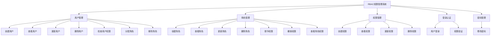
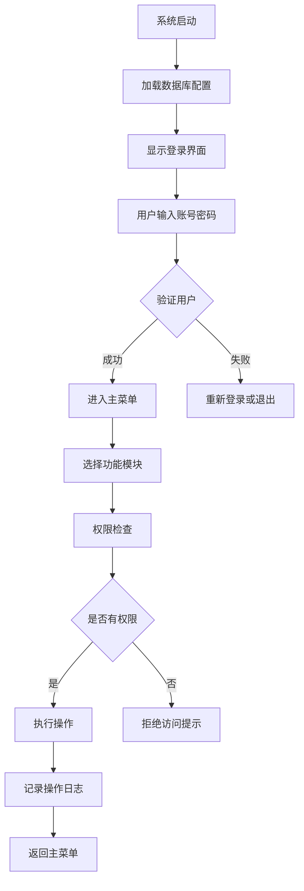
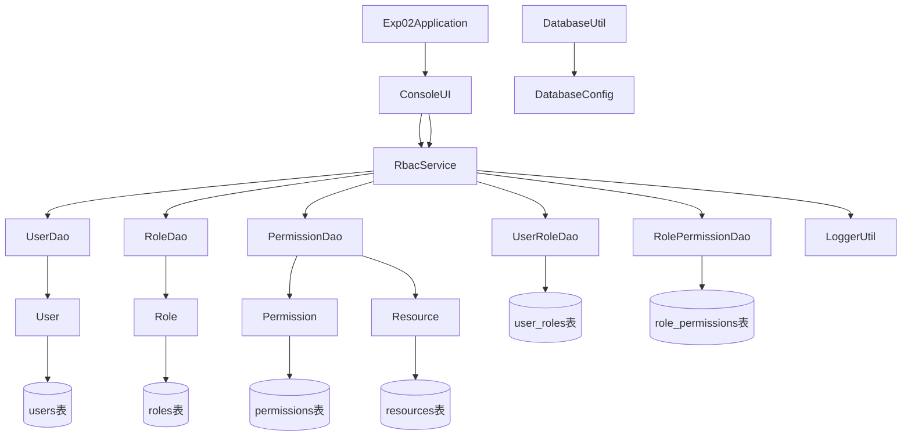

# RBAC权限管理系统设计文档

## 1. 软件功能

本系统是一个基于角色的访问控制（RBAC）权限管理系统，提供了完整的用户、角色和权限管理功能。

## 功能组织图



## 2. 创新点或特色

1. **完整的RBAC模型实现**：严格按照RBAC模型设计，实现了用户、角色、权限之间的多对多关系
2. **细粒度权限控制**：不仅控制模块访问权限，还细化到具体的操作权限（创建、读取、更新、删除等）
3. **安全认证机制**：增加了用户登录认证和会话管理，确保只有合法用户才能操作系统
4. **操作审计日志**：完整记录用户操作日志，便于追踪和审计
5. **基于角色的功能访问控制**：不同角色的用户只能看到和操作自己有权限的功能
6. **防止自我删除**：用户无法删除自己的账户，提高系统安全性
7. **三次登录尝试限制**：防止暴力破解攻击

## 3. 设计思想（思路）

系统采用分层架构设计思想，将业务逻辑与数据访问分离，提高系统的可维护性和扩展性：

1. **Entity层**：定义数据实体，对应数据库表结构
2. **DAO层**：负责数据访问操作，封装对数据库的增删改查
3. **Service层**：处理业务逻辑，调用DAO完成数据操作
4. **UI层**：提供用户交互界面，调用Service处理业务逻辑
5. **Util层**：提供通用工具类，如数据库连接和日志记录

权限控制方面采用RBAC模型的核心思想：
- 用户与角色多对多关联
- 角色与权限多对多关联
- 通过角色间接关联用户和权限
- 用户权限 = 用户所拥有角色的权限集合

## 4. 设计模式的使用

1. **单例模式**：
   - DatabaseConfig类使用单例模式确保全局只有一个配置实例
   - 保证配置的一致性和节约资源

2. **工厂模式**：
   - DatabaseUtil作为数据库连接工厂，统一管理数据库连接的创建

3. **DAO模式**：
   - 数据访问对象模式，将数据访问逻辑与业务逻辑分离
   - 提高代码复用性和可维护性

4. **分层架构模式**：
   - 采用经典四层架构（Entity、DAO、Service、UI）
   - 各层之间职责明确，降低耦合度

## 5. 程序的结构或者架构

系统采用经典的四层架构：

```
com.cqu.exp02
├── config                  # 配置类
│   └── DatabaseConfig.java # 数据库配置
├── dao                     # 数据访问层
│   ├── PermissionDao.java
│   ├── RoleDao.java
│   ├── RolePermissionDao.java
│   ├── UserDao.java
│   └── UserRoleDao.java
├── entity                  # 实体类
│   ├── Permission.java
│   ├── Resource.java
│   ├── Role.java
│   └── User.java
├── service                 # 业务逻辑层
│   └── RbacService.java
├── ui                      # 用户界面层
│   └── ConsoleUI.java
├── util                    # 工具类
│   ├── DatabaseUtil.java
│   └── LoggerUtil.java
└── Exp02Application.java   # 应用入口
```

技术栈：
- Java 21
- Maven 4.0.0
- MySQL数据库
- Spring Boot JDBC
- Lombok注解库

## 6. 程序主要执行流程图



## 7. 类的说明和类之间的关系图

### 核心类说明

1. **User类**：用户实体，包含用户基本信息（ID、用户名、密码、邮箱、创建时间和更新时间）
2. **Role类**：角色实体，定义系统中的角色（ID、角色名、描述、创建时间和更新时间）
3. **Permission类**：权限实体，定义具体的权限点（ID、权限名、描述、资源、操作、创建时间和更新时间）
4. **Resource类**：资源实体，定义系统中的资源类型（ID、资源名、描述、创建时间和更新时间）
5. **UserDao等DAO类**：数据访问对象，负责与数据库交互，提供增删改查等操作
6. **RbacService类**：业务逻辑处理，协调各组件完成业务功能，包括权限检查等
7. **ConsoleUI类**：命令行用户界面，处理用户输入输出，是用户与系统交互的入口
8. **DatabaseConfig类**：数据库配置管理，使用单例模式加载和提供数据库配置信息
9. **DatabaseUtil类**：数据库工具类，提供数据库连接等通用操作
10. **LoggerUtil类**：日志工具类，提供系统操作的日志记录功能

### 类关系图



## 8. 核心源代码及说明

### 权限检查核心逻辑

```java
public boolean checkPermission(Long userId, String resource, String action) throws SQLException {
    String sql = "SELECT COUNT(*) FROM users u " +
                 "JOIN user_roles ur ON u.id = ur.user_id " +
                 "JOIN role_permissions rp ON ur.role_id = rp.role_id " +
                 "JOIN permissions p ON rp.permission_id = p.id " +
                 "WHERE u.id = ? AND p.resource = ? AND p.action = ?";
    
    try (Connection conn = DatabaseUtil.getConnection();
         PreparedStatement stmt = conn.prepareStatement(sql)) {
        
        stmt.setLong(1, userId);
        stmt.setString(2, resource);
        stmt.setString(3, action);
        
        try (ResultSet rs = stmt.executeQuery()) {
            if (rs.next()) {
                return rs.getInt(1) > 0;
            }
        }
    }
    return false;
}
```

这段代码通过多表联查实现权限验证，检查指定用户是否拥有对特定资源的特定操作权限。

### 登录验证逻辑

```java
private boolean login() {
    for (int attempts = 3; attempts > 0; attempts--) {
        System.out.print("请输入用户名: ");
        String username = scanner.nextLine();
        
        System.out.print("请输入密码: ");
        String password = scanner.nextLine();
        
        try {
            Optional<User> userOpt = rbacService.findUserByUsername(username);
            if (userOpt.isPresent() && userOpt.get().getPassword().equals(password)) {
                currentUser = userOpt.get();
                System.out.println("登录成功！欢迎，" + currentUser.getUsername() + "。");
                LoggerUtil.info("用户登录成功: " + username);
                return true;
            } else {
                System.out.println("用户名或密码错误，您还有" + (attempts - 1) + "次机会。");
                LoggerUtil.warn("用户登录失败: " + username);
            }
        } catch (SQLException e) {
            System.out.println("登录时发生错误: " + e.getMessage());
            LoggerUtil.error("登录时发生数据库错误: " + e.getMessage());
        }
    }
    return false;
}
```

实现了带次数限制的用户登录验证机制，增强了系统安全性。

### 数据库配置加载

```java
public class DatabaseConfig {
    private static DatabaseConfig instance;
    private Properties properties;
    
    private DatabaseConfig() {
        loadProperties();
    }
    
    public static synchronized DatabaseConfig getInstance() {
        if (instance == null) {
            instance = new DatabaseConfig();
        }
        return instance;
    }
    
    private void loadProperties() {
        properties = new Properties();
        try (InputStream input = getClass().getClassLoader().getResourceAsStream("application.properties")) {
            if (input == null) {
                System.out.println("Sorry, unable to find application.properties");
                return;
            }
            properties.load(input);
        } catch (IOException ex) {
            ex.printStackTrace();
        }
    }
    
    public String getProperty(String key) {
        return properties.getProperty(key);
    }
    
    public String getDriver() {
        return properties.getProperty("db.driver");
    }
    
    public String getUrl() {
        return properties.getProperty("db.url");
    }
    
    public String getUsername() {
        return properties.getProperty("db.username");
    }
    
    public String getPassword() {
        return properties.getProperty("db.password");
    }
}
```

使用单例模式确保全局只有一个数据库配置实例，通过Properties类加载配置文件。

## 9. 人工智能应用情况

在系统开发过程中，我们使用了AI助手来帮助完成以下任务：

1. **代码重构**：AI协助识别和重构重复代码，提升代码质量
2. **功能增强**：AI帮助设计并实现权限控制系统和登录验证机制
3. **错误修复**：AI辅助定位和解决代码中的问题
4. **文档编写**：AI协助生成系统设计文档和技术说明
5. **架构优化**：AI提供建议以改善系统架构和设计模式的应用

通过与AI的协作，我们显著提高了开发效率，减少了手动编码时间，并确保了代码质量和安全性。

## 10. 其他

### 安全建议

1. **密码加密**：实际生产环境中应使用哈希算法（如BCrypt）加密存储密码
2. **SQL注入防护**：系统已使用PreparedStatement防止SQL注入攻击
3. **会话管理**：可进一步增强会话超时和并发登录控制
4. **输入验证**：应对用户输入进行更严格的验证和过滤
5. **传输安全**：生产环境应使用HTTPS协议保护数据传输安全

### 扩展方向

1. **Web界面**：可将命令行界面升级为Web界面（如Spring Boot + Thymeleaf）
2. **API接口**：提供RESTful API供其他系统调用
3. **缓存机制**：引入Redis等缓存减少数据库访问压力
4. **分布式部署**：支持集群部署以提高系统可用性
5. **多租户支持**：扩展为支持多租户的SaaS平台权限模型
6. **审计功能增强**：增加更详细的审计跟踪和报告功能
7. **实时通知**：增加用户操作的实时通知功能

### 部署说明

1. 确保已安装Java 21和MySQL数据库
2. 创建rbac_db数据库
3. 更新application.properties中的数据库连接信息
4. 执行schema.sql创建表结构
5. 执行data.sql插入初始数据
6. 使用Maven编译和运行项目：
   ```
   mvn clean install
   mvn spring-boot:run
   ```

### 测试账户

系统预置了三个测试账户：
1. 管理员账户：用户名"管理员"，密码"admin123"
2. 经理账户：用户名"经理"，密码"manager123"
3. 员工账户：用户名"员工"，密码"employee123"