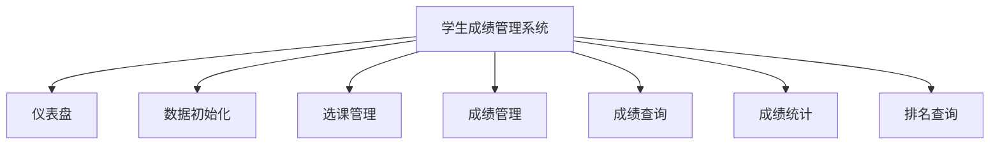
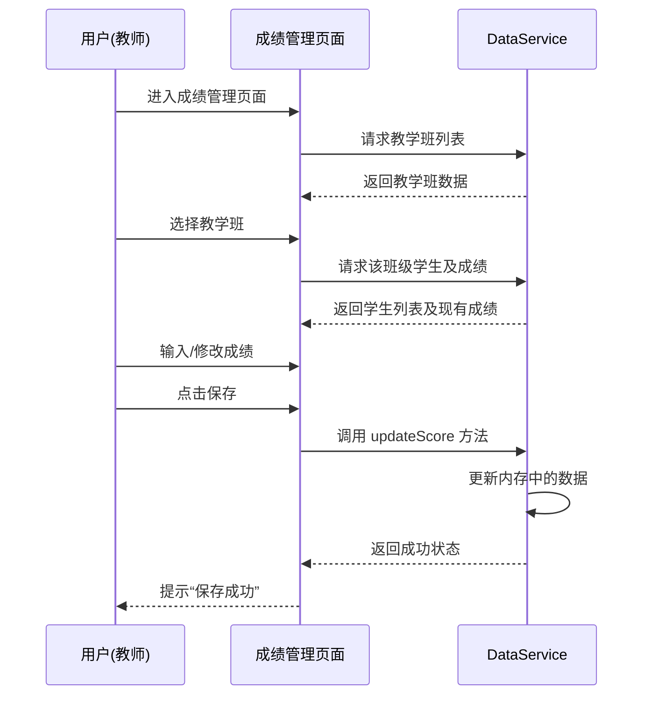
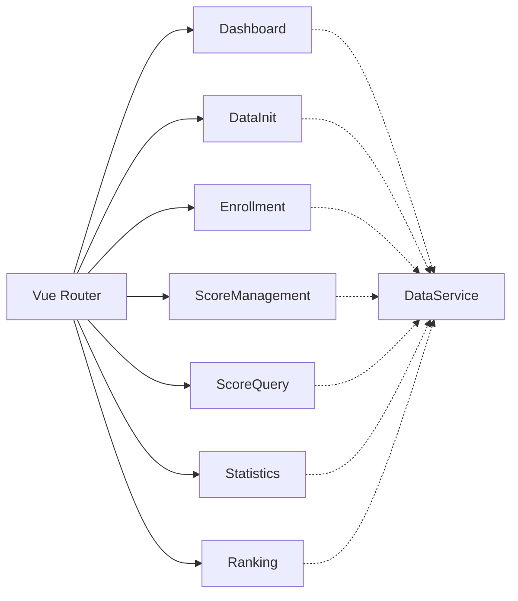

# 实验三：学生成绩管理系统实验报告

## 一、实验目的

1.  掌握 Vue 3 + TypeScript 的前端开发流程。
2.  熟悉 Element Plus 组件库的使用。
3.  理解前端路由（Vue Router）和状态管理（Pinia）的应用。
4.  实现一个功能完善的学生成绩管理系统，包括数据生成、录入、查询、统计等功能。

## 二、实验环境

-   **操作系统**: macOS
-   **开发工具**: VS Code
-   **开发语言**: TypeScript, HTML, CSS
-   **框架/库**: Vue 3, Vite, Element Plus, Pinia, Vue Router

## 三、实验过程或算法

### 1. 软件功能

本系统主要包含以下功能模块：

*   **仪表盘 (Dashboard)**: 展示系统概览，如学生总数、课程总数、班级总数等关键指标。
*   **数据初始化 (Data Initialization)**: 提供一键生成模拟数据的功能，包括学生、教师、课程、教学班及选课记录，方便测试。
*   **选课管理 (Enrollment)**: 模拟学生选课过程，建立学生与教学班的关联。
*   **成绩管理 (Score Management)**: 教师录入和修改学生成绩，支持平时、期中、实验、期末等多维度成绩录入。
*   **成绩查询 (Score Query)**: 提供多条件（学号、姓名、课程等）查询学生成绩的功能。
*   **成绩统计 (Statistics)**: 对成绩进行统计分析，如平均分、及格率、分数段分布等。
*   **排名查询 (Ranking)**: 根据总成绩对学生进行排名展示。

**功能组织图：**



### 2. 创新点或特色

1.  **纯前端模拟全栈体验**: 利用 `DataService` 类在前端完整模拟了数据库和后端逻辑，支持大规模随机数据的生成（学生、教师、课程、成绩），使得在没有后端的情况下也能完整体验系统流程。
2.  **多维度成绩模型**: 成绩不仅仅是一个数字，而是包含了平时成绩、期中成绩、实验成绩、期末成绩的综合评价体系，并支持自定义权重（在 `types/index.ts` 中定义）。
3.  **响应式交互设计**: 使用 Element Plus 组件库构建了现代化、美观且交互流畅的用户界面。
4.  **类型安全**: 全程使用 TypeScript 开发，定义了严格的接口（Student, Teacher, Course, Score 等），保证了代码的健壮性和可维护性。

### 3. 界面设计思想

**设计思路**:
采用“侧边栏导航 + 顶部面包屑 + 内容区域”的经典后台管理系统布局。这种布局结构清晰，用户能快速定位功能。

**技术路线选型**:
*   **构建工具**: Vite。相比 Webpack，Vite 提供了极速的冷启动和热更新体验，极大提高了开发效率。
*   **前端框架**: Vue 3 (Composition API)。相比 Options API，Composition API 更有利于逻辑复用和代码组织，特别适合复杂业务逻辑。
*   **UI 库**: Element Plus。Vue 3 生态中最成熟的 PC 端组件库之一，提供了丰富的表单、表格、图表容器等组件，完美契合管理系统的需求。
*   **语言**: TypeScript。提供静态类型检查，减少运行时错误，提升代码智能提示体验。

### 4. 设计模式的使用

1.  **服务层模式 (Service Pattern)**:
    *   `src/services/dataService.ts` 封装了所有的数据操作逻辑（生成、查询、更新）。视图层（View）不直接操作原始数据，而是通过调用 Service 层的方法。这实现了视图与逻辑的分离。
2.  **单例模式 (Singleton Pattern)**:
    *   虽然代码中可能直接导出了 `DataService` 的实例或者类，但在应用运行期间，数据服务维护了一份全局唯一的内存状态（`students`, `scores` 等数组），起到了单例的作用，确保不同页面访问的数据是一致的。
3.  **组件化设计 (Component-Based)**:
    *   将页面拆分为独立的视图组件（Views），复用性高，易于维护。

### 5. 程序的结构或者架构

项目采用标准的 Vue 3 工程化目录结构：

```
src/
├── assets/          # 静态资源
├── components/      # 公共组件
├── router/          # 路由配置 (index.ts 定义了页面跳转规则)
├── services/        # 业务逻辑层 (dataService.ts 处理数据)
├── types/           # TypeScript 类型定义 (数据模型)
├── views/           # 页面视图 (Dashboard, ScoreManagement 等)
├── App.vue          # 根组件
└── main.ts          # 入口文件
```

### 6. 程序主要执行流程图 (以成绩录入为例)



### 7. 不同界面（组件）之间的关系图

主要通过 Vue Router 进行页面切换，各页面共享 `DataService` 中的数据状态。



### 8. 核心源代码及说明

**1. 数据模型定义 (`src/types/index.ts`)**
定义了系统的核心实体，保证类型安全。

```typescript
// 成绩记录接口
export interface Score {
  id: string
  studentId: string
  studentName: string
  courseId: string
  courseName: string
  teachingClassId: string
  details: ScoreComponent // 包含平时、期中、实验、期末
  totalScore: number      // 总评成绩
  gradePoint: number      // 绩点
}
```

**2. 数据服务 (`src/services/dataService.ts`)**
负责数据的生成和逻辑处理。

```typescript
class DataService {
  // ... 内部存储数组 ...

  // 初始化数据
  initializeData() {
    this.generateTeachers(6)
    this.generateCourses(5)
    this.generateStudents(120)
    this.generateTeachingClasses()
    // ...
  }

  // 生成随机学生
  private generateStudents(count: number) {
    // ... 随机生成姓名、学号等逻辑 ...
  }
  
  // 计算总评成绩
  calculateTotalScore(details: ScoreComponent, weights: ScoreWeight): number {
    return (
      details.usual * weights.usual +
      details.midterm * weights.midterm +
      details.experiment * weights.experiment +
      details.final * weights.final
    )
  }
}
```

**3. 路由配置 (`src/router/index.ts`)**
定义了系统的导航结构。

```typescript
const router = createRouter({
  history: createWebHistory(),
  routes: [
    { path: '/dashboard', component: () => import('@/views/Dashboard.vue') },
    { path: '/score-management', component: () => import('@/views/ScoreManagement.vue') },
    // ... 其他路由
  ]
})
```

### 9. 人工智能应用情况

在本项目开发过程中，使用了 **GitHub Copilot** (基于 Gemini 模型) 辅助开发。

*   **代码生成**: 使用 AI 快速生成了 `DataService` 中的模拟数据生成逻辑（如随机姓名、随机分数），节省了大量编写样板代码的时间。
*   **类型定义**: AI 帮助定义了完善的 TypeScript 接口，确保了数据结构的一致性。
*   **组件构建**: 在编写 Vue 组件时，AI 自动补全了 Element Plus 的表格配置和表单验证逻辑。
*   **Bug 修复**: 在遇到路由跳转或数据响应式更新的问题时，通过询问 AI 快速定位并解决了问题。

**使用截图**: (此处可插入与 AI 对话生成代码的截图)

### 10. 其他需要论述和补充的内容

*   **数据持久化**: 目前系统数据存储在内存中，刷新页面会重置。未来可以考虑使用 `localStorage` 或接入真实的后端数据库（如 MySQL + Spring Boot）来实现数据持久化。
*   **权限控制**: 当前系统未区分角色，未来可以增加登录模块，区分“学生”、“教师”和“管理员”权限，不同角色看到不同的菜单。

## 四、实验结果及分析

### 1. 实验结果

成功构建了一个基于 Web 的学生成绩管理系统。
*   **启动**: 运行 `npm run dev` 后，系统在 `http://localhost:5173` 正常启动。
*   **功能测试**:
    *   点击“数据初始化”，控制台显示数据生成成功，仪表盘数据更新。
    *   进入“成绩管理”，可以选中班级并录入成绩，总分自动计算。
    *   进入“成绩统计”，能看到生成的图表和统计数据。

### 2. 遇到的主要问题及解决

1.  **问题**: 在使用 Element Plus 的 `el-table` 时，数据更新了但视图未刷新。
    *   **分析**: 可能是因为直接修改了数组索引或对象属性，Vue 3 的响应式系统在某些深层嵌套下需要注意。
    *   **解决**: 确保使用 Vue 3 的 `ref` 或 `reactive` 正确包裹数据，并在更新时使用数组的变异方法或重新赋值。

2.  **问题**: TypeScript 报错 `Property 'xxx' does not exist on type 'yyy'`.
    *   **分析**: 类型定义不完整。
    *   **解决**: 在 `types/index.ts` 中补全了缺失的属性定义。

### 3. 实验总结与体会

通过本次实验，我深入理解了现代前端开发的工程化流程。
1.  **Vue 3 的优势**: Composition API 让代码逻辑更加聚合，不再像 Vue 2 那样逻辑分散在 data, methods, mounted 中，大大提高了代码的可读性。
2.  **TypeScript 的重要性**: 虽然编写类型定义需要花费额外时间，但在后续的开发和维护中，它能避免大量的低级错误，重构代码也更加放心。
3.  **组件库的高效**: Element Plus 提供了高质量的组件，让我能专注于业务逻辑的实现，而不用在 UI 样式上花费过多精力。
4.  **全栈思维**: 虽然是前端实验，但通过模拟 DataService，我不得不思考后端的数据结构设计和 API 接口设计，这对培养全栈思维很有帮助。

---
*生成日期: 2025年12月19日*
