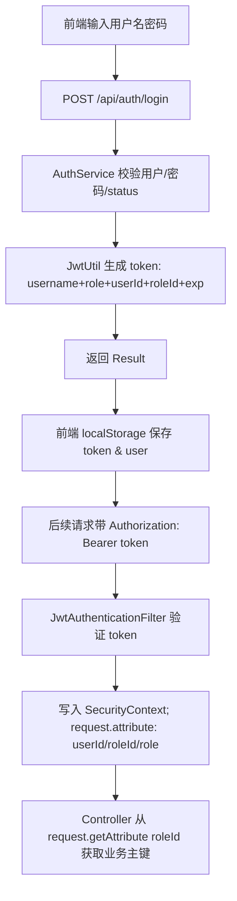
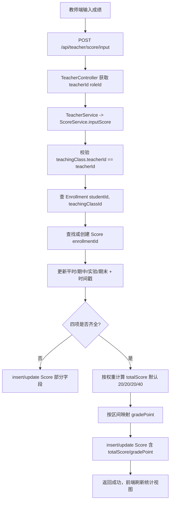
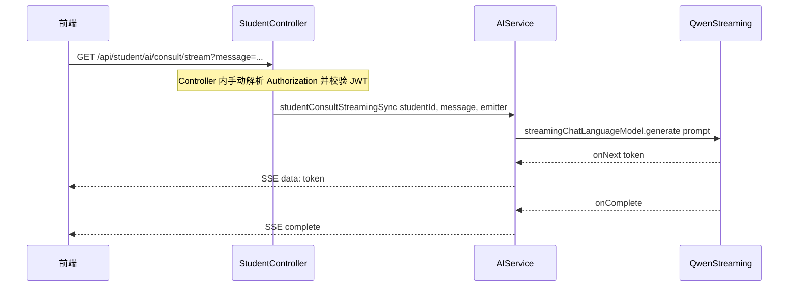

# 实验报告：学生成绩管理系统（Exp04）

> 项目名称：学生成绩管理系统（Student Grade Management System）  
> 技术栈：Spring Boot 3.2.1 / Spring Security + JWT / MyBatis(XML) / MySQL / 原生 JavaScript / LangChain4j + 通义千问(Qwen)  
> 说明：本报告内容基于仓库当前实现整理（以 `src/main/java` 与 `src/main/resources` 为准）。

---

## 目录

- [一、实验目的与任务概述](#一实验目的与任务概述)
- [二、实验环境](#二实验环境)
- [三、实验过程或算法（重点）](#三实验过程或算法重点)
  - [1 软件功能（文字、功能组织图）](#1-软件功能文字功能组织图)
  - [2 创新点或特色](#2-创新点或特色)
  - [3 总体设计思想](#3-总体设计思想)
  - [4 设计模式的使用](#4-设计模式的使用)
  - [5 程序结构/架构](#5-程序结构架构)
  - [6 程序主要执行流程图（清晰美观）](#6-程序主要执行流程图清晰美观)
  - [7 前后端交互接口设计](#7-前后端交互接口设计)
  - [8 安全设计](#8-安全设计)
  - [9 Spring Boot 的详细使用说明](#9-spring-boot-的详细使用说明)
  - [10 实体类与数据库表的详细设计](#10-实体类与数据库表的详细设计)
  - [11 核心源代码及说明](#11-核心源代码及说明)
  - [12 人工智能应用情况](#12-人工智能应用情况)
  - [13 其他需要论述与补充的内容](#13-其他需要论述与补充的内容)
- [四、实验结果及分析 / 源程序调试过程 / 实验总结与体会](#四实验结果及分析--源程序调试过程--实验总结与体会)
  - [4.1 实验结果及分析](#41-实验结果及分析)
  - [4.2 源程序调试过程（问题、截图、文字）](#42-源程序调试过程问题截图文字)
  - [4.3 实验总结与体会（必写）](#43-实验总结与体会必写)
- [附录 A：页面入口与测试账号](#附录-a页面入口与测试账号)
- [附录 B：截图清单（请自行补充）](#附录-b截图清单请自行补充)

---

## 一、实验目的与任务概述

### 1.1 实验目的

1. 熟悉 Spring Boot 3.x 的项目结构、自动配置与构建运行流程。
2. 掌握 REST API 的组织方式与统一响应封装（`Result<T>`）。
3. 掌握 MyBatis（XML Mapper）对 MySQL 的持久化开发流程。
4. 掌握 Spring Security + JWT 的无状态认证与角色权限控制。
5. 探索集成大模型能力（LangChain4j + 通义千问）为教务场景提供智能咨询与分析（含 SSE 流式输出）。

### 1.2 实验任务

完成一个“学生成绩管理系统”，主要包括：

- 学生/教师的注册与登录；
- 学生查看成绩、选课/退课、查看个人信息；
- 教师查看教学班、录入成绩、成绩统计；
- AI：学生学业建议、教师教学分析（支持普通与流式响应）。

---

## 二、实验环境

- 操作系统：macOS（开发）
- JDK：Java 21（项目 `pom.xml` 指定）
- 构建：Maven
- 后端：Spring Boot 3.2.1
- 安全：Spring Security + JWT（JJWT 0.12.5）
- ORM：MyBatis 3.0.3（XML Mapper）
- 数据库：MySQL 8.0+
- 前端：HTML/CSS/原生 JavaScript（静态资源由 Spring Boot 托管）
- AI：LangChain4j + DashScope（通义千问 qwen-max）

> 关于 Redis：`pom.xml` 中包含 `spring-boot-starter-data-redis`，`application.yaml` 也有 Redis 连接配置；但当前业务代码未见 Redis 的调用点，因此**运行主要功能不依赖 Redis**。

---

## 三、实验过程或算法（重点）

### 1 软件功能（文字、功能组织图）

#### 1.1 软件功能（文字说明）

（1）公共功能（无需登录）
- 课程与教学班信息查询：课程列表、课程详情、教学班列表/详情。

（2）学生端功能（ROLE_STUDENT）
- 注册/登录（JWT）
- 查看/修改个人信息
- 查看我的成绩（含平均分、GPA、通过数等统计）
- 查看我的选课、选课、退课（已录入成绩的课程禁止退课）
- AI 学业顾问：基于成绩生成学习建议（普通接口+SSE 流式接口）

（3）教师端功能（ROLE_TEACHER）
- 注册/登录（JWT）
- 查看/修改个人信息
- 查看我的教学班
- 查看教学班学生与成绩
- 录入/更新单个学生成绩；批量录入
- 查看教学班成绩统计
- AI 教学分析：基于统计数据生成教学建议（普通接口+SSE 流式接口）

#### 1.2 功能组织图（文本版，可改绘制成图片）

```text
学生成绩管理系统
├─ 认证中心 /api/auth
│  ├─ 登录 /login
│  ├─ 学生注册 /register/student
│  └─ 教师注册 /register/teacher
├─ 课程公共接口 /api/course（免登录）
│  ├─ 课程列表 /list
│  ├─ 课程详情 /{id}
│  ├─ 可选教学班 /classes
│  └─ 教学班详情 /class/{classId}
├─ 学生端 /api/student（ROLE_STUDENT）
│  ├─ 个人信息 /profile (GET/PUT)
│  ├─ 我的成绩 /scores
│  ├─ 我的选课 /enrollments
│  ├─ 选课 /enroll
│  ├─ 退课 /enroll/{enrollmentId}
│  └─ AI咨询 /ai/consult & /ai/consult/stream
└─ 教师端 /api/teacher（ROLE_TEACHER）
   ├─ 个人信息 /profile (GET/PUT)
   ├─ 我的教学班 /classes
   ├─ 班级学生 /class/{classId}/students
   ├─ 班级成绩 /class/{classId}/scores
   ├─ 成绩录入 /score/input
   ├─ 批量录入 /score/batch
   ├─ 班级统计 /class/{classId}/statistics
   └─ AI分析 /ai/consult & /ai/consult/stream
```

---

### 2 创新点或特色

1. **AI 增强的教务系统**：
   - 学生端：基于个人成绩上下文生成学习建议、薄弱点诊断。
   - 教师端：基于班级统计生成教学改进建议与需重点关注的学生群体。

2. **SSE 流式输出（text/event-stream）**：
   - AI 输出逐 token 返回，前端边接收边渲染（结合 Markdown 渲染库 `marked`）。

3. **JWT 无状态鉴权**：
   - 后端不使用 Session，便于扩展与部署。

4. **业务主键 roleId 透传**：
   - token 中包含 `userId` 与 `roleId`（学生/教师表主键），Controller 可直接用于业务查询与校验。

---

### 3 总体设计思想

采用“前后端不分离但接口化”的设计：

- 前端页面作为静态资源由 Spring Boot 直接托管（`resources/static`）。
- 业务交互全部通过 `/api/**` 调用，保持接口化、可替换前端。
- 后端采用典型三层：Controller（接口入口）-> Service（业务）-> Mapper（SQL）。
- 安全权责分离：
  - Security（JWT + 角色权限）负责“能否访问”；
  - Service 层对“能否操作某资源（例如教师是否属于该班）”做业务级二次校验。

---

### 4 设计模式的使用

1. **分层架构（Layered Architecture）**：Controller/Service/Mapper。
2. **DTO/VO 模式**：
   - DTO：`LoginRequest`、`StudentRegisterRequest`、`TeacherRegisterRequest`、`ScoreInputRequest`、`AIConsultRequest`。
   - VO：`LoginResponse`、`ClassScoreStatisticsVO`、`StudentScoreVO`、统一返回 `Result<T>`。
3. **Builder 模式**（Lombok `@Builder`）：`LoginResponse.builder()`、`User.builder()` 等。
4. **过滤器模式（Filter）**：`JwtAuthenticationFilter` 解析 token 并写入 `SecurityContext`。
5. **配置/工厂式注入（Spring @Configuration + @Bean）**：`SecurityConfig`、`LangChain4jConfig`。

---

### 5 程序结构/架构

#### 5.1 代码组织结构

- `com.cqu.exp04.config`：安全与 AI 配置
- `com.cqu.exp04.controller`：REST API 入口
- `com.cqu.exp04.dto`：请求参数对象
- `com.cqu.exp04.entity`：实体类
- `com.cqu.exp04.mapper`：MyBatis Mapper 接口
- `com.cqu.exp04.security`：JWT 工具与过滤器
- `com.cqu.exp04.service`：业务服务（部分直接写成 `@Service` 类，如 `ScoreService`、`AIService`）
- `com.cqu.exp04.vo`：统一返回与统计视图对象

前端静态资源：`src/main/resources/static/`

#### 5.2 软件设计架构（部署视角）

```text
浏览器(HTML/JS)
   |
   | HTTP 调用 /api/**
   v
Spring Boot 应用（内置 Tomcat）
   |
   | JDBC
   v
MySQL 数据库
   |
   |（可选外部服务调用）
   v
DashScope / 通义千问 API（LangChain4j）
```

---

### 6 程序主要执行流程图（清晰美观）

> 本节给出 Mermaid 图，若你的报告需要插入图片，可在 Mermaid 编辑器导出 PNG 后粘贴。

#### 6.1 登录与鉴权（JWT）流程



#### 6.2 教师录入成绩（计算总评与绩点）流程



#### 6.3 AI 流式咨询（SSE）流程（学生端示例）



---

### 7 前后端交互接口设计

#### 7.1 统一返回结构

- 成功：`{ code: 200, message: "success", data: ... }`
- 失败：`{ code: 500, message: "错误信息", data: null }`

#### 7.2 主要接口（节选）

- 登录：`POST /api/auth/login`
- 学生：
  - `GET /api/student/scores`
  - `GET /api/student/enrollments`
  - `POST /api/student/enroll`
  - `DELETE /api/student/enroll/{enrollmentId}`
  - `POST /api/student/ai/consult`
  - `GET /api/student/ai/consult/stream`
- 教师：
  - `GET /api/teacher/classes`
  - `GET /api/teacher/class/{classId}/scores`
  - `POST /api/teacher/score/input`
  - `GET /api/teacher/class/{classId}/statistics`
  - `POST /api/teacher/ai/consult`
  - `GET /api/teacher/ai/consult/stream`
- 公共课程：
  - `GET /api/course/list`
  - `GET /api/course/classes`

#### 7.3 前端调用方式

前端统一在 `static/js/api.js` 中封装了 `request()`：
- 自动读取 `localStorage.token`
- 在 headers 中加入 `Authorization: Bearer <token>`
- 统一 JSON 解析与 401 处理

---

### 8 安全设计

1. **密码加密**：BCrypt（`PasswordEncoder` Bean）。
2. **JWT**：token 内含 role、userId、roleId 与 expiration。
3. **角色权限**：`SecurityConfig` 中对 `/api/student/**`、`/api/teacher/**` 做角色限制。
4. **业务级校验**：如教师查询班级/录入成绩前校验班级归属。
5. **SSE 鉴权策略**：SSE 端点在 Security 中放行，但 Controller 内手动解析并校验 JWT（避免异步分发导致上下文问题）。

---

### 9 Spring Boot 的详细使用说明

1. 启动类：`Exp04Application` + `@MapperScan("com.cqu.exp04.mapper")`。
2. 配置文件：`application.yaml` 配置端口、MySQL、MyBatis、JWT、LangChain4j。
3. 注入与配置：
   - `SecurityConfig`：`SecurityFilterChain`、`PasswordEncoder`
   - `LangChain4jConfig`：`StreamingChatLanguageModel`
4. 事务控制：注册/选课/退课/成绩录入等写操作使用 `@Transactional`。
5. 静态资源：`resources/static` 自动映射到 Web 根路径。

---

### 10 实体类与数据库表的详细设计

> 以下为逻辑表设计说明（字段以 `entity/*` 与 `resources/mapper/*Mapper.xml` 映射为准）。

#### 10.1 表与实体对应

- `user` ↔ `User`：username、password、role、real_name、email、phone、status、create_time、update_time。
- `student` ↔ `Student`：student_no、user_id、name、gender、birth_date、major、class_name、grade、enrollment_year。
- `teacher` ↔ `Teacher`：teacher_no、user_id、name、gender、title、department、email、phone。
- `course` ↔ `Course`：course_no、course_name、credit、hours、course_type、description。
- `teaching_class` ↔ `TeachingClass`：class_no、course_id、teacher_id、semester、max_students、current_students、classroom、schedule、status。
- `enrollment` ↔ `Enrollment`：student_id、teaching_class_id、enroll_time、status。
- `score` ↔ `Score`：enrollment_id、student_id、teaching_class_id、usual/midterm/experiment/final/total、grade_point、各分项时间。
- `score_weight` ↔ `ScoreWeight`：course_id、usual_weight、midterm_weight、experiment_weight、final_weight（当前实现默认权重 20/20/20/40）。

#### 10.2 关键关系（ER 文字版）

- user 1—1 student / teacher（按角色划分）
- course 1—N teaching_class
- teacher 1—N teaching_class
- student N—N teaching_class（通过 enrollment）
- enrollment 1—0..1 score

---

### 11 核心源代码及说明

> 本节给出“模块-关键类-说明”，便于在答辩/提交时引用。

#### 11.1 认证与安全

- `SecurityConfig`：配置请求放行规则、角色限制、注册 JWT 过滤器。
- `JwtAuthenticationFilter`：解析 Authorization 头，校验 token，写入 SecurityContext。
- `JwtUtil`：生成 token、解析 role/userId/roleId、验证过期。
- `AuthServiceImpl`：登录校验密码与账号状态，生成 token 返回。

#### 11.2 学生业务

- `StudentServiceImpl`：
  - `register()`：写入 `user` + `student`，返回带 token 的 `LoginResponse`。
  - `getMyScores()`：查询成绩并计算平均分/GPA/通过等统计。
  - `enrollCourse()`：校验容量/重复选课，插入 enrollment 并更新 current_students。
  - `dropCourse()`：若已有成绩则禁止退课。

#### 11.3 教师业务

- `TeacherServiceImpl`：
  - `getMyClasses()`：查询教师教学班。
  - `getClassStudents()/getClassScores()`：查询班级学生与成绩。
  - `inputScore()/batchInputScores()`：委托 `ScoreService.inputScore()` 统一处理录入规则。

#### 11.4 成绩计算与统计

- `ScoreService`：
  - `inputScore()`：写入分项成绩与时间戳，四项齐全则计算总评与绩点。
  - `getClassStatistics()`：统计平均分、最高/最低、分段人数、通过率、优秀率。

#### 11.5 AI 服务

- `AIService`：
  - `studentConsult()`：拼接学生成绩上下文 + Prompt -> 生成建议。
  - `teacherConsult()`：拼接班级统计上下文 + Prompt -> 生成教学分析。
  - `studentConsultStreamingSync()/teacherConsultStreamingSync()`：SSE 流式输出。

---

### 12 人工智能应用情况

#### 12.1 使用的 AI 与方式

- 模型：通义千问（DashScope）`qwen-max`
- 框架：LangChain4j
- 输出方式：
  - 普通输出：`ChatLanguageModel.generate(prompt)`
  - 流式输出：`StreamingChatLanguageModel.generate(prompt, handler)`，在 `onNext(token)` 中通过 `SseEmitter` 推送到前端。

#### 12.2 AI 完成的任务与结果

1. 学生：根据成绩与提问，生成课程薄弱点诊断、学习路径与练习建议。
2. 教师：根据统计指标与提问，生成教学改进建议与需关注学生群体。

#### 12.3 AI 使用截图（占位）

- （截图1）学生端 AI 学业顾问对话界面
- （截图2）教师端 AI 教学分析对话界面
- （截图3）`application.yaml` 的 LangChain4j / DashScope 配置（请遮挡真实 key）
- （截图4）后端控制台日志/调试信息

#### 12.4 AI 辅助开发过程（可写法示例）

- 使用 AI 辅助提出 Prompt 结构与输出格式要求；
- 使用 AI 辅助排查 SSE 与 SecurityContext 的常见问题；
- 使用 AI 辅助生成接口文档与测试用例建议（最终由开发者核对与落地）。

---

### 13 其他需要论述与补充的内容

1. **Redis 依赖说明**：目前未使用 Redis，若后续需要缓存、AI 对话记忆、验证码等，可启用并扩展。
2. **可扩展点：ScoreWeight**：存在权重实体，可扩展到“课程/教学班可配置权重”，当前实现使用默认 20/20/20/40。
3. **异常处理改进**：目前 Controller 多采用 try-catch 返回 `Result.error`，可升级为 `@RestControllerAdvice` 做统一异常处理。

---

## 四、实验结果及分析 / 源程序调试过程 / 实验总结与体会

### 4.1 实验结果及分析

- 完成学生/教师注册登录与角色权限隔离；
- 学生端可查看成绩统计、选课/退课；
- 教师端可查看教学班与成绩、录入成绩并查看统计；
- AI 咨询/分析可正常生成，流式接口可逐步输出并在前端实时展示。

### 4.2 源程序调试过程（问题、截图、文字）

> 下面给出常见问题模板，你可以替换为你实际遇到的问题并插入截图。

**问题1：接口返回 401 未授权**
- 现象：前端调用 API 被重定向/提示 Unauthorized。
- 排查：检查 `api.js` 是否带上 `Authorization: Bearer <token>`；检查 token 是否过期。
- 解决：重新登录刷新 token；统一由 `API.request()` 封装请求。
- 截图：浏览器 Network 面板的请求头与响应状态。

**问题2：SSE 流式接口无法持续输出**
- 现象：只返回一次或直接中断。
- 排查：确认后端接口返回 `text/event-stream`；确认前端正确读取 `response.body.getReader()`。
- 解决：采用后端 `StreamingChatLanguageModel` 的 `onNext()` 推送 token；前端按行解析 `data:`。
- 截图：Network 的事件流/前端控制台输出。

**问题3：MyBatis 关联对象为空**
- 现象：课程名/教师名等显示为 `-`。
- 排查：检查 XML `resultMap association` 字段别名是否一致；检查 join 的列别名。
- 解决：补齐 SQL join 与别名映射。
- 截图：控制台 MyBatis SQL 日志与页面显示。

### 4.3 实验总结与体会（必写）

（请根据你的真实体验撰写，下面给一个可直接使用的版本）

通过本次实验，我完成了一个包含“账号体系、权限控制、成绩管理、统计分析、AI 增强功能”的 Web 应用，实现了从数据库建模、后端接口开发、前端交互到安全与智能化的完整闭环。

1. Spring Boot 能快速搭建可运行的后端服务，结合 MyBatis 能灵活控制 SQL 与结果映射。
2. Spring Security + JWT 能实现无状态的角色权限控制，但需要配合业务层的资源归属校验才能保证安全。
3. SSE 流式返回能显著提升 AI 交互体验，但也带来鉴权与连接管理等工程问题，需要在后端与前端共同处理。
4. AI 的引入能让传统成绩系统具备“解释与建议”能力，Prompt 设计对结果质量影响很大，需要不断迭代。

---

## 附录 A：页面入口与测试账号

### A.1 页面入口

- 首页/登录：`http://localhost:8080/index.html`
- 学生端：`http://localhost:8080/student.html`
- 教师端：`http://localhost:8080/teacher.html`

### A.2 测试账号（以页面提示为准）

- 学生：2023100001 / 123456
- 教师：T1001 / 123456

---

## 附录 B：截图清单（请自行补充）

- [ ] 系统首页/登录页
- [ ] 学生端：成绩列表与统计
- [ ] 学生端：选课/退课操作
- [ ] 教师端：教学班列表
- [ ] 教师端：成绩录入与统计页
- [ ] 学生端 AI 学业咨询（普通/流式）
- [ ] 教师端 AI 教学分析（普通/流式）
- [ ] 后端运行日志（含 MyBatis SQL 输出）
- [ ] （可选）关键代码截图：`SecurityConfig`、`JwtAuthenticationFilter`、`AIService` Prompt

