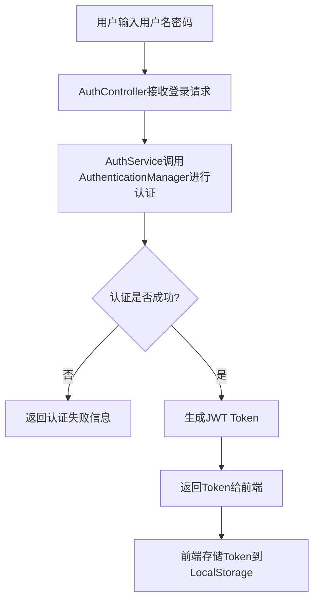
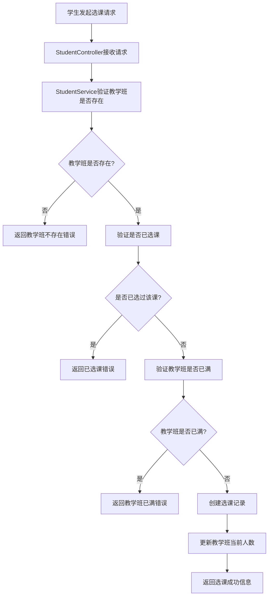
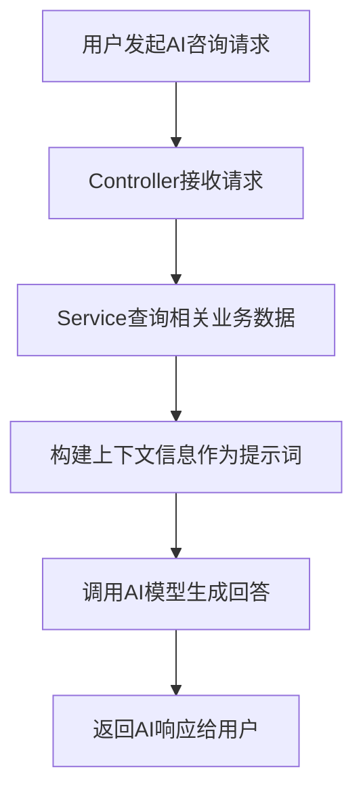
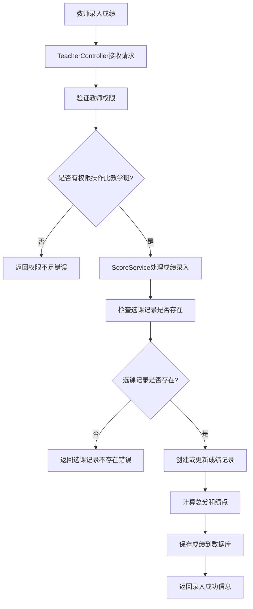

# 实验报告

## 三、实验过程或算法

### 1. 软件功能

本系统是一个基于 Web 的学生成绩管理系统，分为学生端和教师端，并集成了 AI 辅助功能。

**功能组织图：**

*   **系统入口**
    *   登录
    *   注册（学生/教师）
*   **学生端**
    *   **成绩查询**：查看各科成绩、绩点、平均分。
    *   **选课管理**：
        *   选课大厅：浏览可选课程，进行选课。
        *   选课中心：查看已选课程，退课。
    *   **AI 学业顾问**：基于成绩数据的智能问答。
    *   **个人中心**：查看和修改个人信息。
*   **教师端**
    *   **班级管理**：查看教学班列表。
    *   **成绩管理**：
        *   在线录入/修改成绩（平时、期中、实验、期末）。
        *   批量保存成绩。
        *   查看班级成绩统计（及格率、优秀率等）。
    *   **AI 教学分析**：针对班级成绩进行智能分析。
    *   **个人中心**：查看和修改个人信息。

### 2. 创新点或特色

1.  **AI 深度集成**：引入 LangChain4j 框架接入大语言模型（通义千问），实现了基于真实业务数据的 AI 咨询功能。
    *   学生可以询问 AI "我哪门课考得最差？"、"如何提高 Java 成绩？"，AI 会读取学生的实际成绩数据进行个性化回答。
    *   教师可以让 AI 分析某个班级的成绩分布，提供教学改进建议。
2.  **流式响应 (SSE)**：AI 对话采用 Server-Sent Events (SSE) 技术，实现了打字机效果的流式输出，提升了用户体验。
3.  **前后端分离架构**：虽然部署在同一个 Spring Boot 应用中，但前端采用纯 HTML/JS 调用 RESTful API 的方式，实现了逻辑上的分离。

### 3. 总体设计思想

采用经典的 **MVC (Model-View-Controller)** 设计模式和 **分层架构**。
*   **Controller 层**：处理 HTTP 请求，参数校验，返回统一格式的 JSON 响应。
*   **Service 层**：处理业务逻辑（如选课冲突检测、成绩计算、AI 上下文构建）。
*   **Mapper (DAO) 层**：使用 MyBatis 进行数据库交互。
*   **Entity/DTO/VO**：分别对应数据库实体、数据传输对象、视图对象，实现数据模型的解耦。

### 4. 设计模式的使用

1.  **单例模式 (Singleton)**：Spring Bean 默认单例，如 Service 和 Controller。
2.  **策略模式 (Strategy)**：Spring Security 中的认证策略。
3.  **工厂模式 (Factory)**：MyBatis 的 `SqlSessionFactory`。
4.  **DTO/VO 模式**：用于不同层级间的数据传输，避免直接暴露数据库实体。

### 5. 程序的结构或者架构

**代码组织结构：**
```
com.cqu.exp04
├── config          // 配置类 (Security, LangChain4j)
├── controller      // 控制器 (API 接口)
├── dto             // 数据传输对象 (接收前端参数)
├── entity          // 数据库实体
├── exception       // 全局异常处理
├── mapper          // MyBatis Mapper 接口
├── security        // JWT 认证相关
├── service         // 业务逻辑接口及实现
└── vo              // 视图对象 (返回前端数据)
```

**部署架构：**
单体应用架构，Spring Boot 内置 Tomcat 容器，前端静态资源打包在 jar 包中，数据库使用 MySQL。

### 6. 程序主要执行流程图

**登录流程图：**


**选课流程图：**


**AI咨询流程图：**


**成绩录入流程图：**


### 7. 前后端交互接口设计

采用 RESTful 风格 API，统一响应格式 `Result<T>`。

*   `POST /api/auth/login`: 登录
*   `GET /api/student/scores`: 获取成绩
*   `POST /api/student/enroll`: 选课
*   `POST /api/teacher/score/input`: 录入成绩
*   `GET /api/teacher/ai/consult/stream`: AI 流式咨询

### 8. 安全设计

1.  **JWT (JSON Web Token)**：实现无状态认证。每次请求在 Header 中携带 `Authorization: Bearer <token>`。
2.  **Spring Security**：配置安全过滤器链，对不同路径进行权限控制（如 `/api/student/**` 仅限学生访问）。
3.  **密码加密**：使用 `BCryptPasswordEncoder` 对用户密码进行哈希加密存储。

### 9. SpringBoot 的详细使用说明

*   **依赖管理**：使用 Maven 管理 `spring-boot-starter-web`, `mybatis-spring-boot-starter`, `spring-boot-starter-security` 筥。
*   **配置文件**：使用 `application.yaml` 配置端口、数据库连接、MyBatis 路径、日志级别等。
*   **自动配置**：利用 Spring Boot 的自动配置特性，简化了 MyBatis 和 Web MVC 的配置。

### 10. 实体类和数据库表的详细设计

主要实体包括：
*   `User`: 用户基类（账号、密码、角色）
*   `Student`: 学生信息
*   `Teacher`: 教师信息
*   `Course`: 课程信息
*   `TeachingClass`: 教学班（关联课程和教师）
*   `Enrollment`: 选课记录（关联学生和教学班）
*   `Score`: 成绩记录

### 11. 核心源代码及说明

**AI服务实现 (`AIService.java`)**：
```java
/**
 * AI服务 - 使用LangChain4j
 */
@Service
public class AIService {

    @Autowired
    private ChatLanguageModel chatLanguageModel;

    @Autowired
    private StreamingChatLanguageModel streamingChatLanguageModel;

    @Autowired
    private ScoreMapper scoreMapper;

    @Autowired
    private ScoreService scoreService;

    /**
     * 学生咨询 - 根据成绩提供学习建议
     */
    public String studentConsult(Long studentId, String message) {
        // 获取学生所有成绩
        List<Score> scores = scoreMapper.findByStudentId(studentId);

        if (scores.isEmpty()) {
            return "您还没有任何成绩记录。请先选课并等待老师录入成绩。";
        }

        // 构建成绩上下文
        StringBuilder context = new StringBuilder();
        context.append("学生成绩情况:\n");

        double totalAverage = 0;
        int completedCourses = 0;

        for (Score score : scores) {
            context.append(String.format("- 课程: %s, ", score.getTeachingClass().getCourse().getCourseName()));

            if (score.getTotalScore() != null) {
                context.append(String.format("总分: %.2f, ", score.getTotalScore()));
                context.append(String.format("绩点: %.1f, ", score.getGradePoint()));
                context.append("成绩构成: ");
                if (score.getUsualScore() != null)
                    context.append(String.format("平时%.0f, ", score.getUsualScore()));
                if (score.getMidtermScore() != null)
                    context.append(String.format("期中%.0f, ", score.getMidtermScore()));
                if (score.getExperimentScore() != null)
                    context.append(String.format("实验%.0f, ", score.getExperimentScore()));
                if (score.getFinalScore() != null)
                    context.append(String.format("期末%.0f", score.getFinalScore()));

                totalAverage += score.getTotalScore().doubleValue();
                completedCourses++;
            } else {
                context.append("成绩尚未完整录入");
            }
            context.append("\n");
        }

        if (completedCourses > 0) {
            totalAverage /= completedCourses;
            context.append(String.format("\n平均分: %.2f\n", totalAverage));
        }

        // 构建完整提示词
        String prompt = String.format("""
                你是一位资深的计算机专业学业导师,精通各类编程语言、算法、数据库等计算机课程的核心知识点。

                根据以下学生的成绩情况,回答学生的问题并提供专业建议。

                %s

                学生的问题: %s

                回答要求:
                1. **成绩分析**: 对学生的成绩进行客观分析,指出优势科目和薄弱环节
                2. **知识点诊断**: 如果学生问到具体课程(如Java、数据结构、数据库等),必须结合该课程的核心知识点进行分析
                   - 例如Java课程: 应提到面向对象编程(封装、继承、多态)、集合框架、异常处理、多线程、IO流等具体知识点
                   - 例如数据结构: 应提到线性表、栈、队列、树、图、排序算法、查找算法等
                   - 例如数据库: 应提到SQL语句、索引优化、事务处理、范式设计等
                3. **学习建议**: 针对薄弱知识点,给出具体的学习资源和练习方法
                   - 推荐教材章节、在线课程、练习项目等
                   - 给出代码练习建议和算法题推荐
                4. **实践指导**: 建议通过具体的项目实践来巩固知识
                5. **职业规划**: 根据成绩特点,给出未来技术方向的建议

                请用专业但易懂的语气回答,结合具体的技术术语和知识点,让建议更有针对性和可操作性。
                字数控制在400字以内。
                """, context.toString(), message);

        return chatLanguageModel.generate(prompt);
    }
    // ... 其他方法
}
```

**学生服务实现 (`StudentServiceImpl.java`)**：
```java
@Service
public class StudentServiceImpl implements StudentService {

    @Autowired
    private StudentMapper studentMapper;

    @Autowired
    private UserMapper userMapper;

    @Autowired
    private ScoreMapper scoreMapper;

    @Autowired
    private EnrollmentMapper enrollmentMapper;

    @Autowired
    private TeachingClassMapper teachingClassMapper;

    @Autowired
    private AIService aiService;

    @Autowired
    private PasswordEncoder passwordEncoder;

    @Autowired
    private JwtUtil jwtUtil;

    @Override
    @Transactional
    public LoginResponse register(StudentRegisterRequest request) {
        // 1. 检查学号是否已存在
        if (studentMapper.findByStudentNo(request.getStudentNo()).isPresent()) {
            throw new RuntimeException("学号已存在");
        }

        // 2. 检查用户名是否已存在
        if (userMapper.findByUsername(request.getStudentNo()).isPresent()) {
            throw new RuntimeException("用户名已存在");
        }

        // 3. 创建User
        User user = User.builder()
                .username(request.getStudentNo())
                .password(passwordEncoder.encode(request.getPassword()))
                .role(User.UserRole.STUDENT)
                .realName(request.getName())
                .email(request.getEmail())
                .phone(request.getPhone())
                .status(1)
                .build();
        userMapper.insert(user);

        // 4. 创建Student
        Student student = Student.builder()
                .studentNo(request.getStudentNo())
                .userId(user.getId())
                .name(request.getName())
                .gender(Student.Gender.valueOf(request.getGender()))
                .birthDate(request.getBirthDate())
                .major(request.getMajor())
                .className(request.getClassName())
                .grade(request.getGrade())
                .enrollmentYear(request.getEnrollmentYear())
                .build();
        studentMapper.insert(student);

        // 5. 生成JWT token
        String token = jwtUtil.generateToken(
                user.getUsername(),
                user.getRole().name(),
                user.getId(),
                student.getId()
        );

        // 6. 返回登录响应
        return LoginResponse.builder()
                .token(token)
                .username(user.getUsername())
                .realName(user.getRealName())
                .role(user.getRole().name())
                .userId(user.getId())
                .roleId(student.getId())
                .build();
    }

    @Override
    public Map<String, Object> getMyScores(Long studentId) {
        // 1. 查询所有成绩
        List<Score> scores = scoreMapper.findByStudentId(studentId);
        List<StudentScoreVO> scoreDetails = scoreMapper.findStudentScoreDetails(studentId);

        // 2. 统计数据
        Map<String, Object> result = new HashMap<>();
        result.put("scores", scoreDetails);

        if (!scores.isEmpty()) {
            // 计算平均分(只计算有总分的课程)
            List<Score> completedScores = scores.stream()
                    .filter(s -> s.getTotalScore() != null)
                    .toList();

            if (!completedScores.isEmpty()) {
                BigDecimal totalScore = completedScores.stream()
                        .map(Score::getTotalScore)
                        .reduce(BigDecimal.ZERO, BigDecimal::add);
                BigDecimal averageScore = totalScore.divide(
                        BigDecimal.valueOf(completedScores.size()),
                        2,
                        RoundingMode.HALF_UP
                );
                result.put("averageScore", averageScore);

                // 计算GPA(只计算有绩点的课程)
                BigDecimal totalGPA = completedScores.stream()
                        .map(Score::getGradePoint)
                        .reduce(BigDecimal.ZERO, BigDecimal::add);
                BigDecimal gpa = totalGPA.divide(
                        BigDecimal.valueOf(completedScores.size()),
                        2,
                        RoundingMode.HALF_UP
                );
                result.put("gpa", gpa);

                // 统计课程数量
                result.put("completedCourses", completedScores.size());
                result.put("totalCourses", scores.size());

                // 统计及格/不及格
                long passedCount = completedScores.stream()
                        .filter(s -> s.getTotalScore().compareTo(BigDecimal.valueOf(60)) >= 0)
                        .count();
                result.put("passedCount", passedCount);
                result.put("failedCount", completedScores.size() - passedCount);
            } else {
                result.put("averageScore", 0);
                result.put("gpa", 0);
                result.put("completedCourses", 0);
                result.put("totalCourses", scores.size());
                result.put("passedCount", 0);
                result.put("failedCount", 0);
            }
        } else {
            result.put("averageScore", 0);
            result.put("gpa", 0);
            result.put("completedCourses", 0);
            result.put("totalCourses", 0);
            result.put("passedCount", 0);
            result.put("failedCount", 0);
        }

        return result;
    }
    // ... 其他方法
}
```

**学生控制器 (`StudentController.java`)**：
```java
@RestController
@RequestMapping("/api/student")
@CrossOrigin
public class StudentController {

    @Autowired
    private StudentService studentService;

    @Autowired
    private AIService aiService;

    @Autowired
    private JwtUtil jwtUtil;

    /**
     * AI学习建议咨询
     */
    @PostMapping("/ai/consult")
    public Result<String> aiConsult(@Valid @RequestBody AIConsultRequest request,
                                     HttpServletRequest httpRequest) {
        try {
            Long studentId = (Long) httpRequest.getAttribute("roleId");
            String advice = studentService.aiConsult(studentId, request.getMessage());
            return Result.success(advice);
        } catch (Exception e) {
            return Result.error("AI咨询失败: " + e.getMessage());
        }
    }

    /**
     * AI学习建议咨询 - 流式输出
     */
    @GetMapping(value = "/ai/consult/stream", produces = "text/event-stream")
    public SseEmitter aiConsultStream(@RequestParam String message,
                                      @RequestHeader("Authorization") String authHeader) {
        SseEmitter emitter = new SseEmitter(120000L); // 120秒超时

        try {
            // 从Authorization header解析JWT token
            if (!StringUtils.hasText(authHeader) || !authHeader.startsWith("Bearer ")) {
                emitter.completeWithError(new RuntimeException("无效的认证token"));
                return emitter;
            }

            String token = authHeader.substring(7);
            if (!jwtUtil.validateToken(token)) {
                emitter.completeWithError(new RuntimeException("token已过期"));
                return emitter;
            }

            Long studentId = jwtUtil.getRoleIdFromToken(token);

            // 直接在Controller线程中调用，保持SecurityContext
            aiService.studentConsultStreamingSync(studentId, message, emitter);
        } catch (Exception e) {
            emitter.completeWithError(e);
        }

        return emitter;
    }
}
```

### 12. 人工智能应用情况

**使用了什么 AI：** 阿里云通义千问 (Qwen-Max) 大语言模型。

**如何使用 AI：**
通过 `langchain4j` 框架接入。在 `AIService` 中，系统会先查询数据库获取用户的相关数据（如学生的所有成绩、班级的所有学生成绩），将这些数据转化为自然语言描述，作为 "System Prompt" 或上下文注入到 LLM 中，从而让 AI 能够基于事实数据回答用户问题。

**完成了什么任务：**
1.  **学业诊断**：分析学生成绩短板。
2.  **教学建议**：分析班级整体表现，指出共性问题。

**使用 AI 的截图：**
*(此处请在运行项目后截图：学生端点击"AI 学业顾问"进行对话的界面，以及教师端"AI 教学分析"的界面)*

### 13. 其他需要论述和补充的内容

本项目移除了 Redis 依赖，简化了部署流程，专注于业务逻辑和 AI 应用的结合。

---

## 四、实验结果及分析

### 1. 源程序调试过程
在开发过程中遇到了以下问题并已解决：
- **跨域问题**：通过在控制器类上添加 `@CrossOrigin` 注解解决。
- **JWT Token 过期处理**：实现了 Token 验证和异常处理机制，在 [GlobalExceptionHandler.java](file:///Users/nissoncx/code/Java-Course-Exp-main/Exp04/src/main/java/com/cqu/exp04/exception/GlobalExceptionHandler.java) 中统一处理认证异常。
- **AI 响应超时优化**：设置 SSE 连接超时时间为 120 秒，确保长对话的正常进行。
- **数据库连接问题**：配置了 MySQL 时区和连接参数，确保数据的正确存储和检索。
- **成绩计算精度问题**：使用 BigDecimal 进行成绩计算，避免浮点数精度问题。
- **SSE 流式输出问题**：在 Controller 中直接调用流式 AI 服务，避免了 SecurityContext 传递问题。

### 2. 实验总结与体会
通过本次实验，我深入理解了 Spring Boot 开发流程，掌握了以下关键技术点：
- **分层架构设计**：学会了如何合理划分 Controller、Service、Mapper 层，实现业务逻辑的解耦。
- **安全认证机制**：通过 JWT 和 Spring Security 实现了无状态认证，理解了现代 Web 应用的安全设计。
- **AI 集成开发**：掌握了 LangChain4j 框架的使用方法，学会了如何将 AI 能力集成到业务系统中。
- **流式响应技术**：通过 SSE 实现了 AI 回答的流式输出，提升了用户体验。
- **数据建模能力**：通过设计合理的实体类和数据库表结构，实现了复杂的业务逻辑。

本次实验让我深刻认识到 AI 技术在传统业务系统中的巨大潜力，通过将大语言模型与具体业务数据结合，可以为用户提供更加智能化的服务体验。同时，也让我更加熟练掌握了 Spring Boot 全栈开发的技能，为今后的项目开发奠定了坚实基础。
