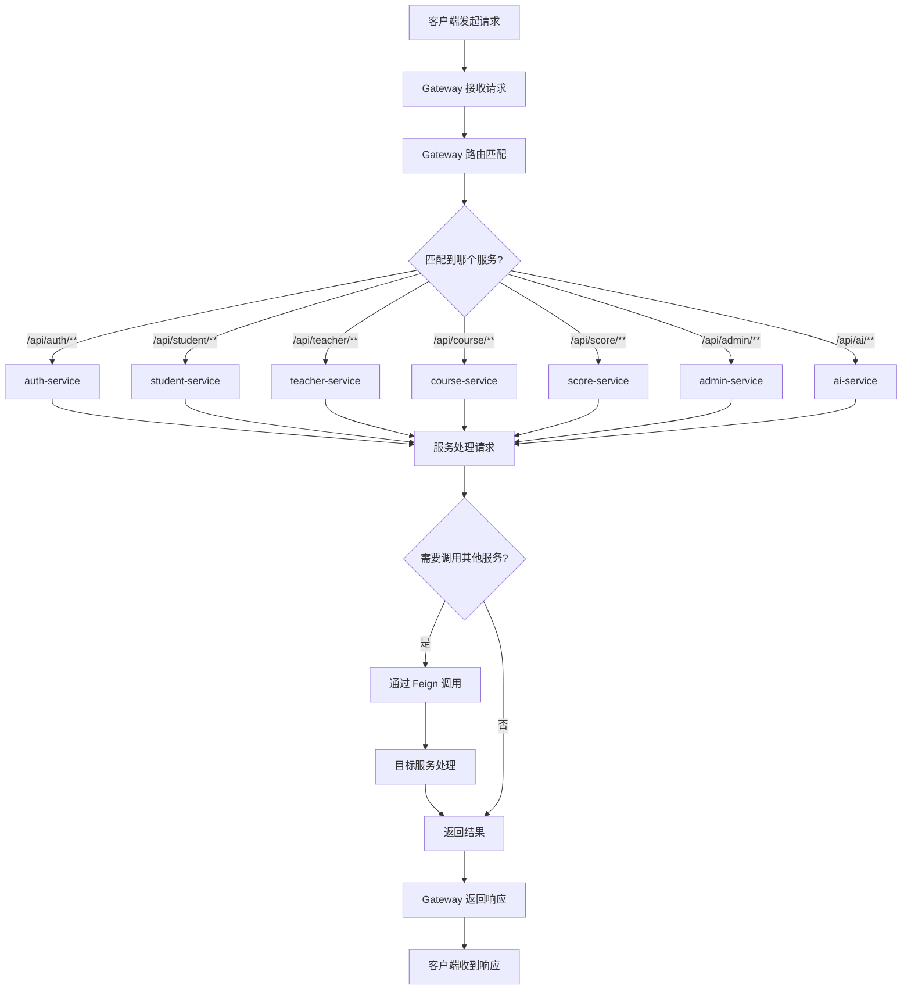
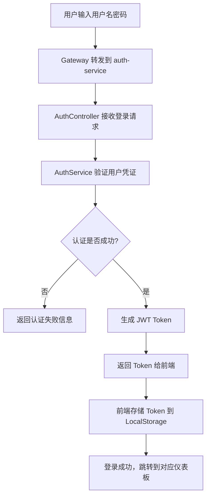
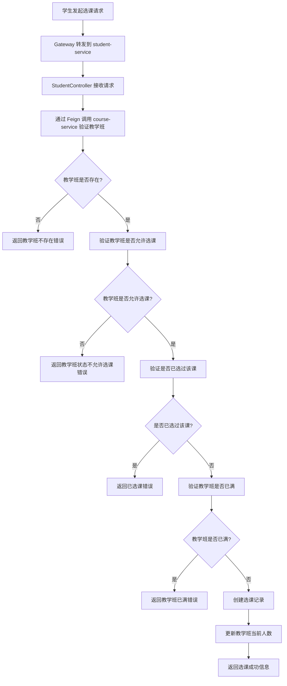
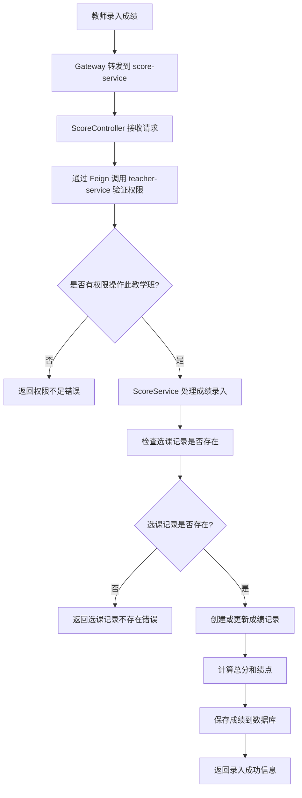
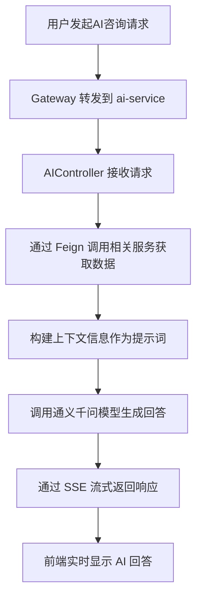

# 实验报告

## 三、实验过程或算法

### 1. 软件功能

本系统是一个基于 **微服务架构** 的学生成绩管理系统，分为学生端、教师端和管理员端，并集成了 AI 辅助功能。系统采用 Spring Cloud 技术栈，通过 Nacos 实现服务注册与发现，使用 Spring Cloud Gateway 作为统一网关。

**功能组织图：**

*   **系统入口**
    *   登录（auth-service）
    *   注册（学生/教师）
*   **学生端**（student-service）
    *   **成绩查询**：查看各科成绩、绩点、平均分。
    *   **选课管理**：
        *   选课大厅：浏览可选课程，进行选课。
        *   选课中心：查看已选课程，退课。
    *   **AI 学业顾问**：基于成绩数据的智能问答（ai-service）。
    *   **个人中心**：查看和修改个人信息。
*   **教师端**（teacher-service）
    *   **班级管理**：查看教学班列表。
    *   **成绩管理**：
        *   在线录入/修改成绩（平时、期中、实验、期末）。
        *   批量保存成绩（score-service）。
        *   查看班级成绩统计（及格率、优秀率等）。
    *   **AI 教学分析**：针对班级成绩进行智能分析（ai-service）。
    *   **个人中心**：查看和修改个人信息。
*   **管理员端**（admin-service）
    *   **学生管理**：创建新学生账号和档案信息。
    *   **教师管理**：创建新教师账号和档案信息。
    *   **课程管理**：创建和管理课程信息（course-service）。
    *   **教学班管理**：为课程分配授课教师，设置教学班信息。

### 2. 创新点或特色

1.  **微服务架构设计**：采用 Spring Cloud 微服务架构，将系统拆分为多个独立服务（auth、student、teacher、course、score、admin、ai、gateway、core），实现了服务的独立部署、扩展和维护。
2.  **服务注册与发现**：使用 Nacos 作为服务注册中心，实现服务的自动注册与发现，支持服务的动态扩缩容。
3.  **统一网关路由**：使用 Spring Cloud Gateway 作为 API 网关，统一管理所有服务的路由、跨域配置和负载均衡。
4.  **服务间通信**：使用 OpenFeign 实现服务间的声明式 HTTP 调用，简化了微服务之间的通信。
5.  **AI 深度集成**：引入 LangChain4j 框架接入大语言模型（通义千问），实现了基于真实业务数据的 AI 咨询功能。
    *   学生可以询问 AI "我哪门课考得最差？"、"如何提高 Java 成绩？"，AI 会读取学生的实际成绩数据进行个性化回答。
    *   教师可以让 AI 分析某个班级的成绩分布，提供教学改进建议。
6.  **流式响应 (SSE)**：AI 对话采用 Server-Sent Events (SSE) 技术，实现了打字机效果的流式输出，提升了用户体验。
7.  **前后端分离架构**：前端采用纯 HTML/JS 调用 RESTful API 的方式，通过 Gateway 统一访问后端微服务。

### 3. 总体设计思想

采用 **微服务架构** 和 **分层设计** 相结合的方式：

**微服务层面：**
*   **Gateway 层**：统一入口，负责路由转发、跨域处理、负载均衡。
*   **业务服务层**：各微服务独立处理特定业务领域（认证、学生、教师、课程、成绩、管理、AI）。
*   **公共库层**：抽取公共代码（common、security-common）供各服务复用。

**单服务层面（MVC 分层）：**
*   **Controller 层**：处理 HTTP 请求，参数校验，返回统一格式的 JSON 响应。
*   **Service 层**：处理业务逻辑（如选课冲突检测、成绩计算、AI 上下文构建）。
*   **Mapper (DAO) 层**：使用 MyBatis-Plus 进行数据库交互。
*   **Feign Client 层**：声明式调用其他微服务的接口。
*   **Entity/DTO/VO**：分别对应数据库实体、数据传输对象、视图对象，实现数据模型的解耦。

### 4. 设计模式的使用

1.  **单例模式 (Singleton)**：Spring Bean 默认单例，如 Service 和 Controller。
2.  **策略模式 (Strategy)**：Spring Security 中的认证策略。
3.  **工厂模式 (Factory)**：MyBatis 的 `SqlSessionFactory`。
4.  **代理模式 (Proxy)**：OpenFeign 使用动态代理实现声明式 HTTP 调用。
5.  **外观模式 (Facade)**：Gateway 作为系统的统一入口，隐藏了后端微服务的复杂性。
6.  **DTO/VO 模式**：用于不同层级间的数据传输，避免直接暴露数据库实体。

### 5. 程序的结构或者架构

**微服务架构图：**

```
┌─────────────────────────────────────────────────────────────────────────┐
│                              客户端 (Browser)                            │
└─────────────────────────────────────────────────────────────────────────┘
                                      │
                                      ▼
┌─────────────────────────────────────────────────────────────────────────┐
│                     Spring Cloud Gateway (8080)                          │
│                    路由转发 / 跨域处理 / 负载均衡                          │
└─────────────────────────────────────────────────────────────────────────┘
                                      │
              ┌───────────────────────┼───────────────────────┐
              │                       │                       │
              ▼                       ▼                       ▼
┌─────────────────────┐ ┌─────────────────────┐ ┌─────────────────────┐
│   auth-service      │ │  student-service    │ │  teacher-service    │
│      (8081)         │ │      (8082)         │ │      (8083)         │
│   用户认证/注册      │ │   学生业务/选课      │ │   教师业务/班级      │
└─────────────────────┘ └─────────────────────┘ └─────────────────────┘
              │                       │                       │
              ▼                       ▼                       ▼
┌─────────────────────┐ ┌─────────────────────┐ ┌─────────────────────┐
│  course-service     │ │   score-service     │ │   admin-service     │
│      (8084)         │ │      (8085)         │ │      (8086)         │
│   课程/教学班管理    │ │   成绩录入/统计      │ │   管理员功能         │
└─────────────────────┘ └─────────────────────┘ └─────────────────────┘
              │                       │                       │
              ▼                       ▼                       ▼
┌─────────────────────┐ ┌─────────────────────┐ ┌─────────────────────┐
│    ai-service       │ │   core-service      │ │      Nacos          │
│      (8087)         │ │      (8088)         │ │      (8848)         │
│   AI咨询/分析        │ │  静态资源/兼容API    │ │   服务注册与发现     │
└─────────────────────┘ └─────────────────────┘ └─────────────────────┘
                                      │
                                      ▼
                        ┌─────────────────────┐
                        │       MySQL         │
                        │    数据库 (3306)     │
                        └─────────────────────┘
```

**项目代码组织结构：**
```
stu-grade-microservices/
├── libs/                           # 公共库
│   ├── common/                     # 公共实体、DTO、工具类
│   │   └── src/main/java/com/cqu/common/
│   │       ├── dto/                # 数据传输对象
│   │       ├── entity/             # 数据库实体
│   │       ├── result/             # 统一响应格式
│   │       └── util/               # 工具类
│   └── security-common/            # 安全公共模块
│       └── src/main/java/com/cqu/security/
│           ├── JwtUtil.java        # JWT 工具类
│           ├── JwtAuthenticationFilter.java
│           └── SecurityConfig.java # 安全配置
├── services/                       # 微服务模块
│   ├── gateway/                    # API 网关
│   ├── auth-service/               # 认证服务
│   ├── student-service/            # 学生服务
│   ├── teacher-service/            # 教师服务
│   ├── course-service/             # 课程服务
│   ├── score-service/              # 成绩服务
│   ├── admin-service/              # 管理员服务
│   ├── ai-service/                 # AI 服务
│   └── core-service/               # 核心服务（静态资源、兼容API）
└── pom.xml                         # 父 POM（依赖管理）
```

**单个微服务内部结构（以 student-service 为例）：**
```
student-service/
└── src/main/java/com/cqu/student/
    ├── StudentApplication.java     # 启动类
    ├── controller/                 # 控制器
    │   └── StudentController.java
    ├── service/                    # 业务逻辑
    │   ├── StudentService.java
    │   └── impl/
    │       └── StudentServiceImpl.java
    ├── mapper/                     # 数据访问
    │   └── StudentMapper.java
    └── client/                     # Feign 客户端
        ├── CourseServiceClient.java
        ├── ScoreServiceClient.java
        └── AuthServiceClient.java
```

### 6. 程序主要执行流程图

**微服务请求流程图：**


**登录流程图（微服务版）：**


**选课流程图（微服务版）：**


**成绩录入流程图（微服务版）：**


**AI咨询流程图（微服务版）：**


### 7. 前后端交互接口设计

采用 RESTful 风格 API，通过 **Spring Cloud Gateway** 统一路由，统一响应格式 `Result<T>`。

**Gateway 路由配置：**

| 路径模式 | 目标服务 | 说明 |
|---------|---------|------|
| `/api/auth/**` | auth-service | 认证相关接口 |
| `/api/student/**` | student-service | 学生业务接口 |
| `/api/teacher/**` | teacher-service | 教师业务接口 |
| `/api/course/**` | course-service | 课程管理接口 |
| `/api/score/**` | score-service | 成绩管理接口 |
| `/api/admin/**` | admin-service | 管理员接口 |
| `/api/ai/**` | ai-service | AI 服务接口 |
| `/api/student/ai/**` | core-service | 学生 AI 咨询 |
| `/api/teacher/ai/**` | core-service | 教师 AI 分析 |

**主要 API 接口：**

**认证服务 (auth-service)：**
*   `POST /api/auth/login`: 用户登录
*   `POST /api/auth/register`: 用户注册
*   `GET /api/auth/user/{userId}`: 获取用户信息
*   `PUT /api/auth/user/{userId}`: 更新用户信息

**学生服务 (student-service)：**
*   `GET /api/student/scores`: 获取学生成绩
*   `GET /api/student/enrollments`: 获取已选课程
*   `POST /api/student/enroll`: 选课
*   `DELETE /api/student/enroll/{enrollmentId}`: 退课
*   `GET /api/student/profile`: 获取个人信息
*   `PUT /api/student/profile`: 更新个人信息

**教师服务 (teacher-service)：**
*   `GET /api/teacher/classes`: 获取教学班列表
*   `GET /api/teacher/class/{classId}/students`: 获取班级学生
*   `PUT /api/teacher/class/{classId}/status`: 更新教学班状态

**成绩服务 (score-service)：**
*   `POST /api/score/input`: 录入单个成绩
*   `POST /api/score/batch-input`: 批量录入成绩
*   `GET /api/score/class/{classId}/stats`: 获取班级成绩统计

**课程服务 (course-service)：**
*   `GET /api/course/available`: 获取可选课程
*   `GET /api/course/teaching-class/{id}`: 获取教学班详情

**AI 服务：**
*   `GET /api/student/ai/consult/stream`: 学生 AI 咨询（SSE 流式）
*   `GET /api/teacher/ai/consult/stream`: 教师 AI 分析（SSE 流式）

### 8. 服务间通信设计

**OpenFeign 声明式调用：**

各微服务通过 OpenFeign 实现服务间的 HTTP 调用，示例：

```java
// student-service 中调用 course-service
@FeignClient(name = "course-service", path = "/api/course")
public interface CourseServiceClient {
    
    @GetMapping("/teaching-class/{id}")
    Result<TeachingClass> getTeachingClass(@PathVariable("id") Long id);
    
    @GetMapping("/available")
    Result<List<TeachingClass>> getAvailableCourses(@RequestParam("semester") String semester);
}

// teacher-service 中调用 score-service
@FeignClient(name = "score-service", path = "/api/score")
public interface ScoreServiceClient {
    
    @PostMapping("/input")
    Result<?> inputScore(@RequestBody ScoreInputRequest request,
                         @RequestHeader("Authorization") String token);
    
    @PostMapping("/batch-input")
    Result<?> batchInputScore(@RequestBody List<ScoreInputRequest> requests,
                              @RequestHeader("Authorization") String token);
}
```

**服务调用链示例：**
```
学生查看成绩:
  student-service → score-service (获取成绩)
                  → course-service (获取课程信息)

教师录入成绩:
  teacher-service → score-service (录入成绩)
                  → course-service (验证教学班)

学生个人信息:
  student-service → auth-service (获取用户邮箱、电话)
```

### 9. 安全设计

1.  **JWT (JSON Web Token)**：实现无状态认证。每次请求在 Header 中携带 `Authorization: Bearer <token>`。
2.  **Spring Security**：每个微服务配置安全过滤器链，对不同路径进行权限控制。
3.  **密码加密**：使用 `BCryptPasswordEncoder` 对用户密码进行哈希加密存储。
4.  **服务间认证**：Feign 调用时传递 Authorization Header，确保服务间调用的安全性。
5.  **Gateway 跨域配置**：在网关层统一配置 CORS，支持前端跨域访问。

**安全配置示例（security-common）：**
```java
@Configuration
@EnableWebSecurity
public class SecurityConfig {
    
    @Bean
    public SecurityFilterChain filterChain(HttpSecurity http) throws Exception {
        http
            .csrf(csrf -> csrf.disable())
            .cors(cors -> cors.configurationSource(corsConfigurationSource()))
            .sessionManagement(session -> 
                session.sessionCreationPolicy(SessionCreationPolicy.STATELESS))
            .authorizeHttpRequests(auth -> auth
                .requestMatchers("/api/auth/**").permitAll()
                .requestMatchers("/api/score/**").permitAll()  // 服务间调用
                .anyRequest().authenticated()
            )
            .addFilterBefore(jwtAuthenticationFilter, 
                UsernamePasswordAuthenticationFilter.class);
        return http.build();
    }
}
```

### 10. SpringBoot 与 Spring Cloud 的详细使用说明

**Spring Boot 配置：**
*   **依赖管理**：使用 Maven 父 POM 统一管理依赖版本。
*   **配置文件**：各服务使用 `application.yml` 配置端口、数据库连接、Nacos 地址等。
*   **自动配置**：利用 Spring Boot 的自动配置特性，简化了 MyBatis-Plus 和 Web MVC 的配置。

**Spring Cloud 组件：**
*   **Nacos**：服务注册与发现，各服务启动时自动注册到 Nacos。
*   **Spring Cloud Gateway**：API 网关，统一路由和跨域处理。
*   **OpenFeign**：声明式 HTTP 客户端，简化服务间调用。
*   **LoadBalancer**：客户端负载均衡，Gateway 使用 `lb://` 前缀实现负载均衡。

**服务配置示例（student-service）：**
```yaml
server:
  port: 8082

spring:
  application:
    name: student-service
  cloud:
    nacos:
      discovery:
        server-addr: localhost:8848
        namespace: public
  datasource:
    url: jdbc:mysql://localhost:3306/stu_grade?useSSL=false&serverTimezone=Asia/Shanghai
    username: root
    password: your_password
```

### 11. 实体类和数据库表的详细设计

主要实体包括（定义在 libs/common 模块）：
*   `User`: 用户基类（账号、密码、角色、邮箱、电话）
*   `Student`: 学生信息（学号、姓名、班级、专业）
*   `Teacher`: 教师信息（教工号、姓名、职称、学院）
*   `Course`: 课程信息（课程编号、名称、学分、学时）
*   `TeachingClass`: 教学班（关联课程和教师、学期、容量）
*   `Enrollment`: 选课记录（关联学生和教学班）
*   `Score`: 成绩记录（平时、期中、实验、期末、总分、绩点）

**实体关系图：**
```
User (1) ──── (1) Student
User (1) ──── (1) Teacher
Course (1) ──── (N) TeachingClass
Teacher (1) ──── (N) TeachingClass
TeachingClass (1) ──── (N) Enrollment
Student (1) ──── (N) Enrollment
Enrollment (1) ──── (1) Score
```

### 12. 前端功能详细分析

#### 12.1 学生端前端功能

学生端前端采用纯 HTML、CSS 和 JavaScript 实现，通过 Gateway 统一访问后端微服务。

**12.1.1 成绩查询功能**
- **页面结构**：位于 `student.html` 中的 `#view-scores` 区域
- **功能实现**：使用 `student.js` 中的 `loadScores()` 函数，通过 Gateway 调用 student-service 获取成绩数据
- **数据展示**：
  - 统计信息：平均分、平均绩点、修读学分、课程总数
  - 详细表格：展示每门课程的成绩构成（平时、期中、实验、期末）及总评
  - 图表可视化：使用 Chart.js 实现成绩分布柱状图、学科能力雷达图和成绩等级环形图

**12.1.2 选课管理功能**
- **页面结构**：位于 `student.html` 中的 `#view-course-manage` 区域
- **功能实现**：包含两个标签页（Tab）
  - 已选课程：展示学生已选课程列表，支持退课操作
  - 选课大厅：支持按学期查询可选课程，提供选课按钮
- **API 调用**：通过 Gateway 路由到 student-service 和 course-service

**12.1.3 AI 学业顾问功能**
- **页面结构**：位于 `student.html` 中的 `#view-ai-advisor` 区域
- **功能实现**：实现聊天界面，支持流式响应
- **交互逻辑**：
  - 发送消息时调用 `handleSendMessage()` 函数
  - 通过 SSE (Server-Sent Events) 连接到 `/api/student/ai/consult/stream` 端点
  - 使用 marked.js 库处理 AI 返回的 Markdown 格式内容

**12.1.4 个人信息管理功能**
- **页面结构**：位于 `student.html` 中的 `#view-profile` 区域
- **功能实现**：展示学生基本信息（学号、姓名、班级等），支持修改邮箱和电话
- **数据来源**：student-service 通过 Feign 调用 auth-service 获取用户邮箱、电话信息

#### 12.2 教师端前端功能

**12.2.1 我的教学班功能**
- **页面结构**：位于 `teacher.html` 中的 `#view-classes` 区域
- **功能实现**：以卡片形式展示教师的所有教学班，显示课程名称、教学班号、选课人数等信息
- **交互逻辑**：支持点击卡片进入班级详情页，支持修改教学班状态

**12.2.2 班级成绩管理功能**
- **页面结构**：位于 `teacher.html` 中的 `#view-class-detail` 区域
- **功能实现**：
  - 展示班级统计信息（平均分、及格率、最高分、优秀率）
  - 提供成绩录入表格，支持录入平时、期中、实验、期末成绩
  - 支持单行保存和批量保存功能
- **API 调用**：通过 Gateway 路由到 teacher-service 和 score-service

**12.2.3 AI 教学分析功能**
- **页面结构**：位于 `teacher.html` 中的 `#view-analysis` 区域
- **功能实现**：提供选择教学班下拉框和聊天界面
- **交互逻辑**：使用 SSE 连接到 `/api/teacher/ai/consult/stream` 端点获取流式响应

**12.2.4 个人信息管理功能**
- **页面结构**：位于 `teacher.html` 中的 `#view-profile` 区域
- **功能实现**：展示教师基本信息，支持修改邮箱和电话
- **数据来源**：teacher-service 通过 Feign 调用 auth-service 获取用户信息

#### 12.3 管理员端前端功能

**12.3.1 学生管理功能**
- **页面结构**：位于 `admin.html` 中的 `#view-create-student` 区域
- **功能实现**：通过 `admin.js` 中的表单处理学生创建逻辑
- **API 调用**：`POST /api/admin/students` 路由到 admin-service

**12.3.2 教师管理功能**
- **页面结构**：位于 `admin.html` 中的 `#view-create-teacher` 区域
- **功能实现**：创建教师用户账号和档案信息
- **API 调用**：`POST /api/admin/teachers` 路由到 admin-service

**12.3.3 课程管理功能**
- **页面结构**：位于 `admin.html` 中的 `#view-create-course` 区域
- **功能实现**：创建新的课程信息
- **API 调用**：`POST /api/admin/courses` 路由到 admin-service

**12.3.4 教学班管理功能**
- **页面结构**：位于 `admin.html` 中的 `#view-create-teaching-class` 区域
- **功能实现**：为课程分配授课教师，创建教学班
- **数据加载**：动态加载课程列表和教师列表供选择

#### 12.4 前端技术特点

**12.4.1 前端架构特点**
- **单页应用（SPA）**：通过 JavaScript 动态切换页面内容，无需刷新整个页面
- **统一 API 调用**：通过 `api.js` 模块封装 HTTP 请求，统一访问 Gateway
- **响应式设计**：使用 CSS Grid 和 Flexbox 实现响应式布局

**12.4.2 前端数据处理**
- **API 调用**：通过统一的 `api.js` 模块封装 HTTP 请求，所有请求通过 Gateway 路由
- **状态管理**：使用浏览器 LocalStorage 存储 JWT Token 和用户信息
- **数据渲染**：使用 DOM 操作动态渲染表格和图表

**12.4.3 前端可视化功能**
- **图表库集成**：使用 Chart.js 实现多种图表类型（柱状图、雷达图、环形图）
- **实时更新**：图表数据随数据加载实时更新
- **交互式图表**：支持鼠标悬停提示等交互功能

### 13. 后端功能详细分析

#### 13.1 微服务模块说明

| 服务名称 | 端口 | 职责 |
|---------|------|------|
| gateway | 8080 | API 网关，路由转发，跨域处理 |
| auth-service | 8081 | 用户认证、注册、用户信息管理 |
| student-service | 8082 | 学生业务：选课、退课、个人信息 |
| teacher-service | 8083 | 教师业务：班级管理、学生列表 |
| course-service | 8084 | 课程管理、教学班管理 |
| score-service | 8085 | 成绩录入、成绩统计 |
| admin-service | 8086 | 管理员功能：创建学生/教师/课程/教学班 |
| ai-service | 8087 | AI 咨询、教学分析 |
| core-service | 8088 | 静态资源、兼容 API、AI 流式接口 |

#### 13.2 核心业务逻辑实现

**13.2.1 用户认证与授权（auth-service）**
- **认证流程**：使用 Spring Security 和 JWT 实现用户认证
- **控制器**：`AuthController` 处理登录、注册请求
- **服务实现**：`AuthServiceImpl` 负责用户验证和 Token 生成
- **用户信息接口**：提供 `GET/PUT /api/auth/user/{userId}` 供其他服务调用

**13.2.2 学生服务实现（student-service）**
- **主要功能**：`StudentServiceImpl` 实现学生端核心业务逻辑
- **成绩查询**：通过 Feign 调用 score-service 获取成绩数据
- **选课管理**：实现选课和退课逻辑，通过 Feign 调用 course-service 验证教学班
- **个人信息**：通过 Feign 调用 auth-service 获取用户邮箱、电话

以下为选课功能的核心实现代码：

```java
@Override
@Transactional
public void enrollCourse(Long studentId, Long teachingClassId) {
    // 1. 通过 Feign 调用 course-service 检查教学班
    Result<TeachingClass> result = courseServiceClient.getTeachingClass(teachingClassId);
    if (result.getCode() != 200 || result.getData() == null) {
        throw new RuntimeException("教学班不存在");
    }
    TeachingClass teachingClass = result.getData();

    // 2. 检查教学班是否允许选课
    if (teachingClass.getStatus() != 0) {
        throw new RuntimeException("该教学班当前不允许选课");
    }

    // 3. 检查是否已选课
    if (enrollmentMapper.findByStudentAndClass(studentId, teachingClassId).isPresent()) {
        throw new RuntimeException("您已经选过这门课了");
    }

    // 4. 检查教学班是否已满
    if (teachingClass.getCurrentStudents() >= teachingClass.getMaxStudents()) {
        throw new RuntimeException("教学班已满,无法选课");
    }

    // 5. 创建选课记录
    Enrollment enrollment = Enrollment.builder()
            .studentId(studentId)
            .teachingClassId(teachingClassId)
            .enrollTime(LocalDateTime.now())
            .status(1)
            .build();
    enrollmentMapper.insert(enrollment);

    // 6. 通过 Feign 更新教学班人数
    courseServiceClient.incrementStudentCount(teachingClassId);
}
```

**13.2.3 教师服务实现（teacher-service）**
- **主要功能**：`TeacherServiceImpl` 实现教师端核心业务逻辑
- **班级管理**：提供教学班列表、班级学生信息查询
- **成绩管理**：通过 Feign 调用 score-service 实现成绩录入
- **个人信息**：通过 Feign 调用 auth-service 获取和更新用户信息

**13.2.4 成绩管理服务（score-service）**
- **主要功能**：`ScoreServiceImpl` 负责成绩录入、计算和统计
- **成绩计算**：根据平时、期中、实验、期末成绩按权重计算总分和绩点
- **批量录入**：支持批量录入多个学生的成绩
- **统计分析**：提供班级成绩统计信息

以下为成绩录入的核心实现代码：

```java
@Transactional
public void inputScore(ScoreInputRequest request) {
    // 查找选课记录
    Enrollment enrollment = enrollmentMapper.findByStudentAndClass(
            request.getStudentId(), request.getTeachingClassId())
            .orElseThrow(() -> new RuntimeException("选课记录不存在"));

    // 查找或创建成绩记录
    Score score = scoreMapper.findByEnrollmentId(enrollment.getId())
            .orElseGet(() -> {
                Score newScore = new Score();
                newScore.setEnrollmentId(enrollment.getId());
                newScore.setStudentId(request.getStudentId());
                newScore.setTeachingClassId(request.getTeachingClassId());
                return newScore;
            });

    // 更新各项成绩
    LocalDateTime now = LocalDateTime.now();
    if (request.getUsualScore() != null) {
        score.setUsualScore(request.getUsualScore());
        score.setUsualScoreTime(now);
    }
    // ... 其他成绩项更新

    // 计算总分和绩点（使用默认权重）
    if (allScoresPresent(score)) {
        BigDecimal totalScore = calculateTotalScore(score);
        score.setTotalScore(totalScore);
        score.setGradePoint(calculateGradePoint(totalScore));
    }

    // 保存成绩
    if (score.getId() == null) {
        scoreMapper.insert(score);
    } else {
        scoreMapper.update(score);
    }
}
```

#### 13.3 AI 集成功能

**13.3.1 AI 服务设计（ai-service / core-service）**
- **服务类**：`AIService` 负责与大语言模型交互
- **模型集成**：通过 LangChain4j 框架集成通义千问模型
- **上下文构建**：根据用户角色和请求参数，通过 Feign 从其他服务获取数据并构建提示词

**13.3.2 流式响应实现**
- **SSE 支持**：使用 Spring 的 `SseEmitter` 实现 Server-Sent Events
- **异步处理**：在 Controller 中调用 AI 服务的流式方法
- **实时反馈**：通过流式响应实现类似打字机效果的 AI 回答显示

**13.3.3 提示词工程**
- **上下文注入**：将学生的成绩数据或班级的统计信息作为上下文注入到提示词中
- **角色设定**：设定 AI 为学业导师或教学分析专家，提高回答的专业性
- **结构化输出**：通过提示词引导 AI 生成结构化的回答内容

### 14. 人工智能应用情况

**使用了什么 AI：** 阿里云通义千问 (Qwen-Max) 大语言模型。

**如何使用 AI：**
通过 `langchain4j` 框架接入。在 `AIService` 中，系统会先通过 Feign 调用其他微服务获取用户的相关数据（如学生的所有成绩、班级的所有学生成绩），将这些数据转化为自然语言描述，作为 "System Prompt" 或上下文注入到 LLM 中，从而让 AI 能够基于事实数据回答用户问题。

**完成了什么任务：**
1.  **学业诊断**：分析学生成绩短板，提供个性化学习建议。
2.  **教学建议**：分析班级整体表现，指出共性问题，提供教学改进建议。

**使用 AI 的截图：**
*(此处请在运行项目后截图：学生端点击"AI 学业顾问"进行对话的界面，以及教师端"AI 教学分析"的界面)*

### 15. 其他需要论述和补充的内容

#### 15.1 微服务架构优势

1. **独立部署**：各服务可以独立部署和升级，不影响其他服务。
2. **技术异构**：不同服务可以使用不同的技术栈（虽然本项目统一使用 Spring Boot）。
3. **故障隔离**：单个服务故障不会导致整个系统崩溃。
4. **弹性扩展**：可以根据负载情况对特定服务进行水平扩展。

#### 15.2 服务注册与发现（Nacos）

- 各微服务启动时自动注册到 Nacos 服务注册中心
- Gateway 通过 Nacos 发现后端服务，使用 `lb://` 前缀实现负载均衡
- 支持服务的动态上下线，无需重启 Gateway

#### 15.3 公共模块设计

- **common 模块**：包含所有服务共用的实体类、DTO、工具类
- **security-common 模块**：包含 JWT 工具类、安全配置，供各业务服务复用

---

## 四、实验结果及分析

### 1. 源程序调试过程
在开发过程中遇到了以下问题并已解决：
- **服务间通信问题**：通过 OpenFeign 实现声明式 HTTP 调用，解决了微服务间的通信问题。
- **跨域问题**：在 Gateway 层统一配置 CORS，解决了前端跨域访问问题。
- **JWT Token 传递**：在 Feign 调用时传递 Authorization Header，确保服务间调用的安全性。
- **服务发现问题**：配置 Nacos 服务注册中心，实现服务的自动注册与发现。
- **数据一致性问题**：使用 @Transactional 注解确保跨服务操作的数据一致性。
- **AI 响应超时优化**：设置 SSE 连接超时时间为 120 秒，确保长对话的正常进行。
- **成绩计算精度问题**：使用 BigDecimal 进行成绩计算，避免浮点数精度问题。
- **Feign 调用返回类型问题**：正确处理 Feign 返回的 Result 包装类型，避免类型转换错误。

### 2. 实验总结与体会
通过本次实验，我深入理解了微服务架构的设计与实现，掌握了以下关键技术点：
- **微服务架构设计**：学会了如何将单体应用拆分为多个独立的微服务，实现服务的解耦。
- **Spring Cloud 技术栈**：掌握了 Nacos、Gateway、OpenFeign 等 Spring Cloud 组件的使用。
- **服务间通信**：通过 OpenFeign 实现了声明式的服务间 HTTP 调用。
- **API 网关设计**：学会了使用 Spring Cloud Gateway 实现统一路由、跨域处理和负载均衡。
- **安全认证机制**：通过 JWT 和 Spring Security 实现了无状态认证，理解了微服务架构下的安全设计。
- **AI 集成开发**：掌握了 LangChain4j 框架的使用方法，学会了如何将 AI 能力集成到微服务系统中。
- **流式响应技术**：通过 SSE 实现了 AI 回答的流式输出，提升了用户体验。

本次实验让我深刻认识到微服务架构在大型系统中的优势，同时也体会到了微服务带来的复杂性（如服务间通信、数据一致性等）。通过将大语言模型与具体业务数据结合，可以为用户提供更加智能化的服务体验。这次实验为今后的分布式系统开发奠定了坚实基础。
