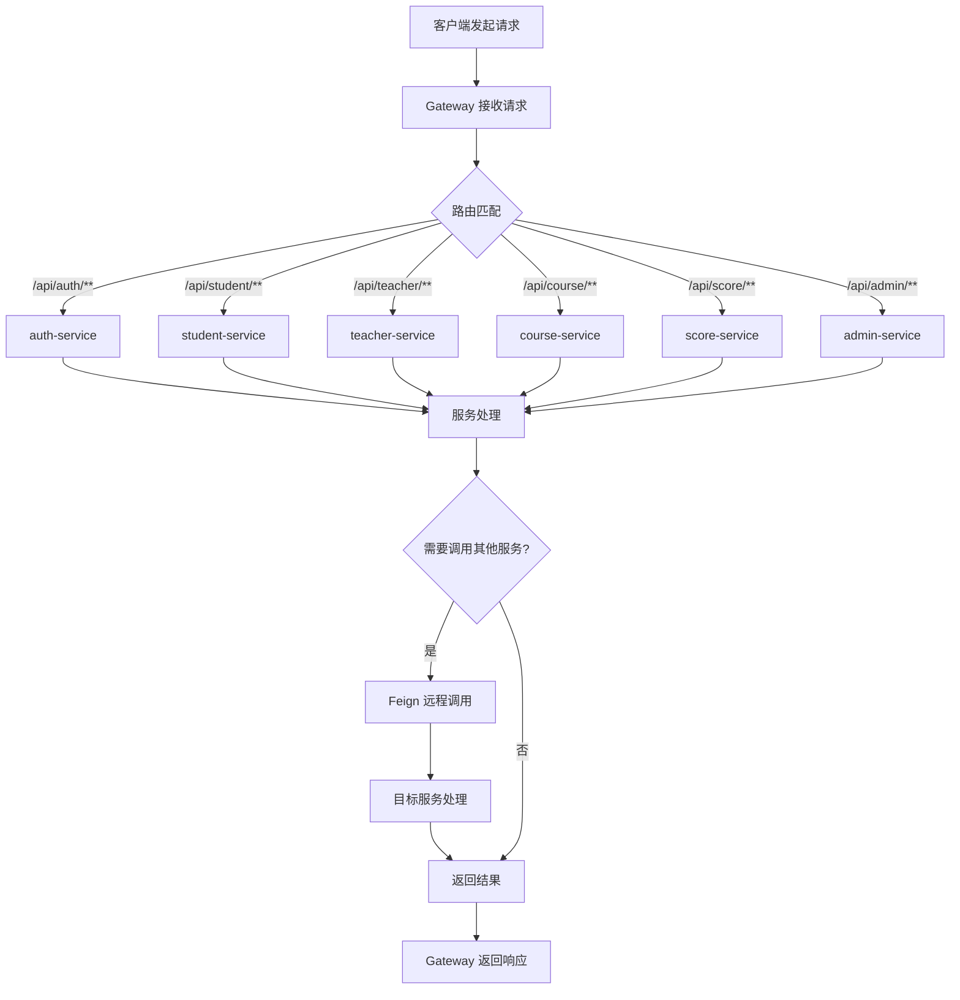
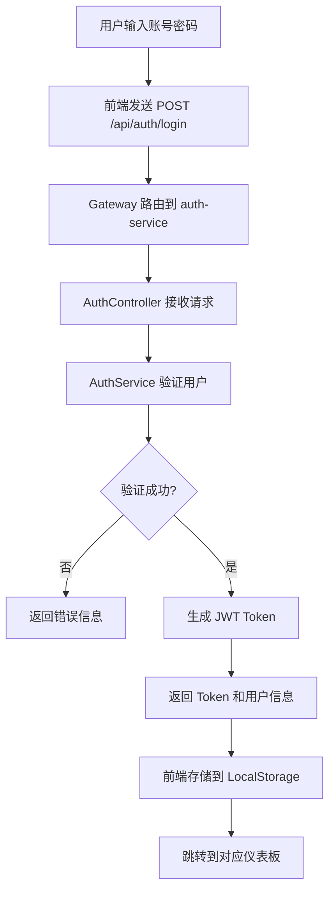
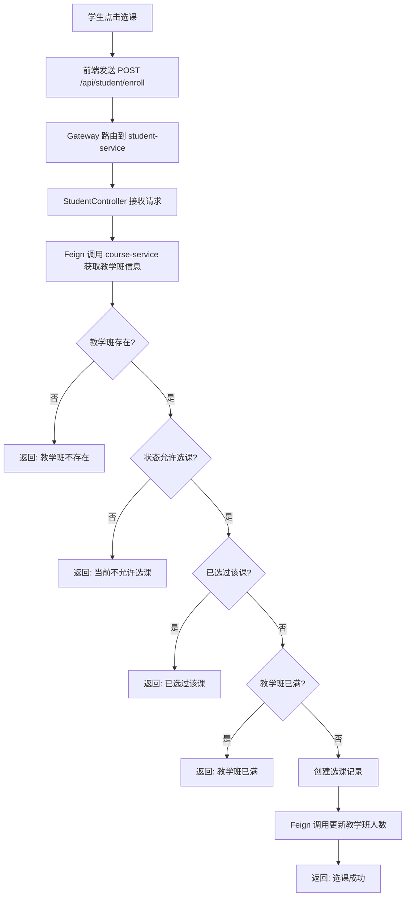
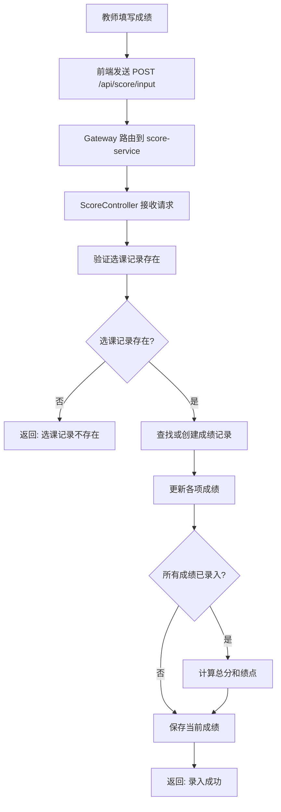
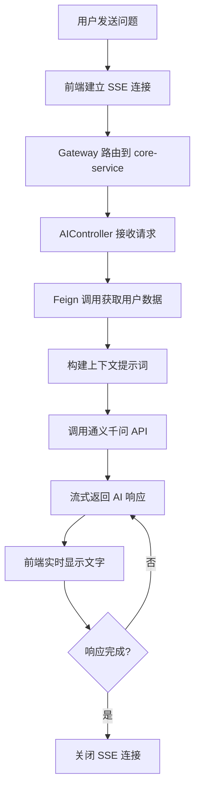

# 学生成绩管理系统 - 实验报告

## 一、软件的功能介绍和特色

### 1. 软件功能

本系统是一个基于 **微服务架构** 的学生成绩管理系统，包含学生端、教师端和管理员端三个角色入口，并集成了 AI 智能辅助功能。

**系统功能模块：**

```
┌─────────────────────────────────────────────────────────────────┐
│                        学生成绩管理系统                           │
├─────────────────┬─────────────────┬─────────────────────────────┤
│     学生端       │     教师端       │         管理员端             │
├─────────────────┼─────────────────┼─────────────────────────────┤
│ • 成绩查询       │ • 教学班管理     │ • 学生账号管理               │
│ • 选课大厅       │ • 成绩录入       │ • 教师账号管理               │
│ • 已选课程       │ • 批量录入成绩   │ • 课程信息管理               │
│ • 退课功能       │ • 成绩统计分析   │ • 教学班管理                 │
│ • AI学业顾问     │ • AI教学分析     │                             │
│ • 个人信息管理   │ • 个人信息管理   │                             │
└─────────────────┴─────────────────┴─────────────────────────────┘
```

**详细功能说明：**

| 模块 | 功能 | 说明 |
|------|------|------|
| 用户认证 | 登录/注册 | JWT 无状态认证，支持学生/教师/管理员三种角色 |
| 成绩查询 | 查看成绩 | 展示各科成绩、绩点、平均分，支持图表可视化 |
| 选课管理 | 选课/退课 | 按学期浏览可选课程，支持选课和退课操作 |
| 成绩录入 | 单个/批量录入 | 教师可录入平时、期中、实验、期末成绩 |
| 成绩统计 | 班级统计 | 展示平均分、及格率、优秀率、最高分等 |
| AI 咨询 | 智能问答 | 基于真实成绩数据的个性化学业建议 |
| 个人中心 | 信息管理 | 查看和修改个人信息（邮箱、电话等） |

### 2. 创新点和特色

1. **微服务架构设计**
   - 将系统拆分为 9 个独立微服务（gateway、auth、student、teacher、course、score、admin、ai、core）
   - 各服务独立部署、独立扩展，实现了高内聚低耦合
   - 使用 Nacos 实现服务注册与发现，支持动态扩缩容

2. **统一网关路由**
   - 使用 Spring Cloud Gateway 作为 API 网关
   - 统一管理路由、跨域配置、负载均衡
   - 前端只需访问网关，无需关心后端服务分布

3. **服务间声明式调用**
   - 使用 OpenFeign 实现服务间的 HTTP 调用
   - 声明式接口定义，代码简洁易维护
   - 自动传递认证信息，保证服务间调用安全

4. **AI 深度集成**
   - 引入 LangChain4j 框架接入通义千问大语言模型
   - 学生可获得基于真实成绩的个性化学习建议
   - 教师可获得班级成绩分析和教学改进建议

5. **流式响应体验**
   - AI 对话采用 Server-Sent Events (SSE) 技术
   - 实现打字机效果的流式输出，提升用户体验

6. **数据可视化**
   - 使用 Chart.js 实现成绩分布柱状图、雷达图、环形图
   - 直观展示学生成绩分布和学科能力

---

## 二、开发和运行环境

### 开发平台
| 项目 | 说明 |
|------|------|
| 操作系统 | macOS / Windows / Linux |
| JDK 版本 | Java 21 |
| 构建工具 | Maven 3.9+ |
| IDE | IntelliJ IDEA 2024 |

### 运行平台
| 组件 | 版本 | 说明 |
|------|------|------|
| Nacos | 2.2.0+ | 服务注册与发现 |
| MySQL | 8.0+ | 关系型数据库 |
| JRE | 21 | Java 运行环境 |

### 第三方组件

**后端依赖：**
| 组件 | 版本 | 用途 |
|------|------|------|
| Spring Boot | 3.2.1 | 应用框架 |
| Spring Cloud | 2023.0.0 | 微服务框架 |
| Spring Cloud Alibaba | 2022.0.0.0 | Nacos 集成 |
| Spring Cloud Gateway | - | API 网关 |
| OpenFeign | - | 服务间调用 |
| MyBatis-Plus | 3.5.7 | ORM 框架 |
| Spring Security | - | 安全框架 |
| JJWT | 0.12.5 | JWT 令牌 |
| LangChain4j | 0.35.0 | AI 框架 |
| Lombok | 1.18.36 | 代码简化 |

**前端依赖：**
| 组件 | 用途 |
|------|------|
| Chart.js | 图表可视化 |
| marked.js | Markdown 渲染 |
| 原生 HTML/CSS/JS | 页面构建 |

### 运行条件
1. 启动 Nacos 服务（端口 8848）
2. 启动 MySQL 数据库（端口 3306）
3. 配置通义千问 API Key（用于 AI 功能）
4. 按顺序启动各微服务

---

## 三、设计说明

### 3. 总体设计思想

采用 **微服务架构** 和 **分层设计** 相结合的方式：

**微服务层面：**
```
┌─────────────────────────────────────────────────────────────┐
│                    Gateway 层（统一入口）                     │
│              路由转发 / 跨域处理 / 负载均衡                    │
├─────────────────────────────────────────────────────────────┤
│                    业务服务层（独立微服务）                    │
│  auth / student / teacher / course / score / admin / ai     │
├─────────────────────────────────────────────────────────────┤
│                    公共库层（代码复用）                        │
│              common（实体/DTO） / security-common（安全）     │
├─────────────────────────────────────────────────────────────┤
│                    基础设施层                                 │
│              Nacos（服务发现） / MySQL（数据存储）             │
└─────────────────────────────────────────────────────────────┘
```

**单服务层面（MVC 分层）：**
- **Controller 层**：处理 HTTP 请求，参数校验，返回统一 JSON 响应
- **Service 层**：处理业务逻辑（选课检测、成绩计算、AI 上下文构建）
- **Mapper 层**：使用 MyBatis-Plus 进行数据库交互
- **Feign Client 层**：声明式调用其他微服务接口
- **Entity/DTO/VO**：数据模型解耦

### 4. 设计模式的使用

| 设计模式 | 应用场景 | 说明 |
|---------|---------|------|
| 单例模式 | Spring Bean | Service、Controller 默认单例 |
| 代理模式 | OpenFeign | 动态代理实现声明式 HTTP 调用 |
| 外观模式 | Gateway | 统一入口，隐藏后端服务复杂性 |
| 工厂模式 | MyBatis | SqlSessionFactory 创建会话 |
| 策略模式 | Spring Security | 认证策略选择 |
| 建造者模式 | Entity 构建 | Lombok @Builder 构建对象 |
| DTO 模式 | 数据传输 | 不同层级间数据传输解耦 |

### 5. 程序的结构或者架构

#### 5.1 代码组织结构

```
stu-grade-microservices/
├── pom.xml                         # 父 POM（统一依赖管理）
├── libs/                           # 公共库模块
│   ├── common/                     # 公共实体、DTO、工具类
│   │   └── src/main/java/com/cqu/common/
│   │       ├── dto/                # ScoreInputRequest, LoginRequest 等
│   │       ├── entity/             # User, Student, Teacher, Course 等
│   │       ├── result/             # Result<T> 统一响应格式
│   │       └── util/               # 工具类
│   └── security-common/            # 安全公共模块
│       └── src/main/java/com/cqu/security/
│           ├── JwtUtil.java        # JWT 生成/验证工具
│           ├── JwtAuthenticationFilter.java  # JWT 过滤器
│           └── SecurityConfig.java # Spring Security 配置
├── services/                       # 微服务模块
│   ├── gateway/                    # API 网关 (8080)
│   ├── auth-service/               # 认证服务 (8081)
│   ├── student-service/            # 学生服务 (8082)
│   ├── teacher-service/            # 教师服务 (8083)
│   ├── course-service/             # 课程服务 (8084)
│   ├── score-service/              # 成绩服务 (8085)
│   ├── admin-service/              # 管理员服务 (8086)
│   ├── ai-service/                 # AI 服务 (8087)
│   └── core-service/               # 核心服务 (8088) - 静态资源/AI流式接口
└── logs/                           # 日志目录
```

#### 5.2 软件设计架构（微服务架构图）

```
┌─────────────────────────────────────────────────────────────────────────┐
│                              浏览器客户端                                │
│                    (student.html / teacher.html / admin.html)           │
└─────────────────────────────────────────────────────────────────────────┘
                                      │
                                      ▼
┌─────────────────────────────────────────────────────────────────────────┐
│                     Spring Cloud Gateway (8080)                          │
│                    ┌─────────────────────────────────┐                   │
│                    │  路由规则 / CORS / 负载均衡      │                   │
│                    └─────────────────────────────────┘                   │
└─────────────────────────────────────────────────────────────────────────┘
          │              │              │              │              │
          ▼              ▼              ▼              ▼              ▼
┌──────────────┐ ┌──────────────┐ ┌──────────────┐ ┌──────────────┐ ┌──────────────┐
│ auth-service │ │student-service│ │teacher-service│ │course-service│ │score-service │
│    (8081)    │ │    (8082)    │ │    (8083)    │ │    (8084)    │ │    (8085)    │
│  用户认证    │ │  学生业务    │ │  教师业务    │ │  课程管理    │ │  成绩管理    │
└──────────────┘ └──────────────┘ └──────────────┘ └──────────────┘ └──────────────┘
          │              │              │              │              │
          └──────────────┴──────────────┴──────────────┴──────────────┘
                                      │
                    ┌─────────────────┼─────────────────┐
                    ▼                 ▼                 ▼
          ┌──────────────┐   ┌──────────────┐   ┌──────────────┐
          │admin-service │   │  ai-service  │   │ core-service │
          │    (8086)    │   │    (8087)    │   │    (8088)    │
          │  管理员功能  │   │   AI 咨询    │   │ 静态资源/兼容│
          └──────────────┘   └──────────────┘   └──────────────┘
                                      │
                    ┌─────────────────┴─────────────────┐
                    ▼                                   ▼
          ┌──────────────────┐               ┌──────────────────┐
          │      Nacos       │               │      MySQL       │
          │     (8848)       │               │     (3306)       │
          │   服务注册发现   │               │    数据存储      │
          └──────────────────┘               └──────────────────┘
```

#### 5.3 部署架构

```
┌─────────────────────────────────────────────────────────────────┐
│                         开发/测试环境                            │
├─────────────────────────────────────────────────────────────────┤
│  ┌─────────────┐  ┌─────────────┐  ┌─────────────┐              │
│  │   Nacos     │  │   MySQL     │  │  通义千问   │              │
│  │  localhost  │  │  localhost  │  │  API 服务   │              │
│  │   :8848     │  │   :3306     │  │  (云端)     │              │
│  └─────────────┘  └─────────────┘  └─────────────┘              │
│         │               │                │                      │
│         └───────────────┼────────────────┘                      │
│                         │                                       │
│  ┌──────────────────────┴──────────────────────┐                │
│  │              IntelliJ IDEA                   │                │
│  │  ┌─────────┐ ┌─────────┐ ┌─────────┐        │                │
│  │  │ gateway │ │  auth   │ │ student │ ...    │                │
│  │  │  :8080  │ │  :8081  │ │  :8082  │        │                │
│  │  └─────────┘ └─────────┘ └─────────┘        │                │
│  └─────────────────────────────────────────────┘                │
└─────────────────────────────────────────────────────────────────┘
```

### 6. 程序主要执行流程图

#### 6.1 微服务请求总体流程



#### 6.2 用户登录流程



#### 6.3 学生选课流程



#### 6.4 教师录入成绩流程



#### 6.5 AI 咨询流程



### 7. 前后端交互接口设计

#### 7.1 Gateway 路由配置

| 路径模式 | 目标服务 | 说明 |
|---------|---------|------|
| `/api/auth/**` | auth-service | 认证相关 |
| `/api/student/ai/**` | core-service | 学生 AI 咨询 |
| `/api/teacher/ai/**` | core-service | 教师 AI 分析 |
| `/api/student/**` | student-service | 学生业务 |
| `/api/teacher/**` | teacher-service | 教师业务 |
| `/api/course/**` | course-service | 课程管理 |
| `/api/score/**` | score-service | 成绩管理 |
| `/api/admin/**` | admin-service | 管理员功能 |
| `/api/ai/**` | ai-service | AI 服务 |
| `/*.html, /css/**, /js/**` | core-service | 静态资源 |

#### 7.2 主要 API 接口

**认证服务 (auth-service)**
| 方法 | 路径 | 说明 |
|------|------|------|
| POST | `/api/auth/login` | 用户登录 |
| POST | `/api/auth/register` | 用户注册 |
| GET | `/api/auth/user/{userId}` | 获取用户信息 |
| PUT | `/api/auth/user/{userId}` | 更新用户信息 |

**学生服务 (student-service)**
| 方法 | 路径 | 说明 |
|------|------|------|
| GET | `/api/student/scores` | 获取成绩列表 |
| GET | `/api/student/enrollments` | 获取已选课程 |
| POST | `/api/student/enroll` | 选课 |
| DELETE | `/api/student/enroll/{id}` | 退课 |
| GET | `/api/student/profile` | 获取个人信息 |
| PUT | `/api/student/profile` | 更新个人信息 |

**教师服务 (teacher-service)**
| 方法 | 路径 | 说明 |
|------|------|------|
| GET | `/api/teacher/classes` | 获取教学班列表 |
| GET | `/api/teacher/class/{id}/students` | 获取班级学生 |
| PUT | `/api/teacher/class/{id}/status` | 更新教学班状态 |
| GET | `/api/teacher/profile` | 获取个人信息 |
| PUT | `/api/teacher/profile` | 更新个人信息 |

**成绩服务 (score-service)**
| 方法 | 路径 | 说明 |
|------|------|------|
| POST | `/api/score/input` | 录入单个成绩 |
| POST | `/api/score/batch-input` | 批量录入成绩 |
| GET | `/api/score/class/{id}/stats` | 班级成绩统计 |

**课程服务 (course-service)**
| 方法 | 路径 | 说明 |
|------|------|------|
| GET | `/api/course/available` | 获取可选课程 |
| GET | `/api/course/teaching-class/{id}` | 获取教学班详情 |

**AI 服务**
| 方法 | 路径 | 说明 |
|------|------|------|
| GET | `/api/student/ai/consult/stream` | 学生 AI 咨询 (SSE) |
| GET | `/api/teacher/ai/consult/stream` | 教师 AI 分析 (SSE) |

#### 7.3 统一响应格式

```java
public class Result<T> {
    private int code;      // 状态码: 200成功, 其他失败
    private String message; // 提示信息
    private T data;        // 响应数据
}
```

**响应示例：**
```json
{
    "code": 200,
    "message": "登录成功",
    "data": {
        "token": "eyJhbGciOiJIUzI1NiJ9...",
        "userId": 1,
        "username": "student001",
        "role": "STUDENT"
    }
}
```

### 8. 安全设计

#### 8.1 认证机制

**JWT (JSON Web Token) 无状态认证：**
```
┌─────────┐      登录请求       ┌─────────────┐
│  客户端  │ ─────────────────> │ auth-service │
│         │ <───────────────── │             │
└─────────┘    返回 JWT Token   └─────────────┘
     │
     │ 携带 Token 请求
     ▼
┌─────────┐  Authorization:    ┌─────────────┐
│  客户端  │  Bearer <token>   │   Gateway   │
│         │ ─────────────────> │             │
└─────────┘                    └─────────────┘
                                     │
                               JWT 验证通过
                                     ▼
                              ┌─────────────┐
                              │  业务服务   │
                              └─────────────┘
```

#### 8.2 安全配置

```java
@Configuration
@EnableWebSecurity
public class SecurityConfig {
    @Bean
    public SecurityFilterChain filterChain(HttpSecurity http) throws Exception {
        http
            .csrf(csrf -> csrf.disable())
            .cors(cors -> cors.configurationSource(corsConfigurationSource()))
            .sessionManagement(session -> 
                session.sessionCreationPolicy(SessionCreationPolicy.STATELESS))
            .authorizeHttpRequests(auth -> auth
                .requestMatchers("/api/auth/**").permitAll()
                .requestMatchers("/api/score/**").permitAll()  // 服务间调用
                .anyRequest().authenticated()
            )
            .addFilterBefore(jwtAuthenticationFilter, 
                UsernamePasswordAuthenticationFilter.class);
        return http.build();
    }
}
```

#### 8.3 安全措施

| 措施 | 说明 |
|------|------|
| JWT 认证 | 无状态令牌认证，每次请求携带 Token |
| 密码加密 | BCrypt 哈希加密存储 |
| CORS 配置 | Gateway 统一配置跨域策略 |
| 服务间认证 | Feign 调用传递 Authorization Header |
| 路径权限 | Spring Security 配置不同路径访问权限 |

### 9. 后端微服务架构设计

#### 9.1 服务划分

| 服务名称 | 端口 | 职责 | 依赖服务 |
|---------|------|------|---------|
| gateway | 8080 | API 网关，路由转发 | Nacos |
| auth-service | 8081 | 用户认证、注册、信息管理 | MySQL |
| student-service | 8082 | 学生选课、退课、个人信息 | auth, course, score |
| teacher-service | 8083 | 教学班管理、学生列表 | auth, course, score |
| course-service | 8084 | 课程、教学班管理 | teacher |
| score-service | 8085 | 成绩录入、统计 | MySQL |
| admin-service | 8086 | 管理员功能 | auth |
| ai-service | 8087 | AI 咨询服务 | 通义千问 API |
| core-service | 8088 | 静态资源、AI 流式接口 | student, teacher, score |

#### 9.2 服务间通信

**OpenFeign 声明式调用示例：**

```java
// student-service 调用 course-service
@FeignClient(name = "course-service", path = "/api/course")
public interface CourseServiceClient {
    
    @GetMapping("/teaching-class/{id}")
    Result<TeachingClass> getTeachingClass(@PathVariable("id") Long id);
    
    @GetMapping("/available")
    Result<List<TeachingClass>> getAvailableCourses(
        @RequestParam("semester") String semester);
}

// teacher-service 调用 score-service
@FeignClient(name = "score-service", path = "/api/score")
public interface ScoreServiceClient {
    
    @PostMapping("/input")
    Result<?> inputScore(@RequestBody ScoreInputRequest request,
                         @RequestHeader("Authorization") String token);
}
```

#### 9.3 服务调用链

```
学生查看成绩:
  Gateway → student-service → score-service (获取成绩)
                            → course-service (获取课程信息)

教师录入成绩:
  Gateway → score-service (录入成绩)

学生个人信息:
  Gateway → student-service → auth-service (获取邮箱、电话)

AI 学业咨询:
  Gateway → core-service → student-service (获取学生信息)
                         → score-service (获取成绩)
                         → 通义千问 API (生成回答)
```

### 10. 前端界面设计

#### 10.1 页面结构

| 页面 | 文件 | 说明 |
|------|------|------|
| 登录页 | index.html | 用户登录入口 |
| 学生端 | student.html | 学生功能界面 |
| 教师端 | teacher.html | 教师功能界面 |
| 管理员端 | admin.html | 管理员功能界面 |

#### 10.2 学生端界面

```
┌─────────────────────────────────────────────────────────────────┐
│  Logo    成绩查询  选课管理  AI学业顾问  个人中心      退出登录   │
├─────────────────────────────────────────────────────────────────┤
│                                                                 │
│  ┌─────────────────────────────────────────────────────────┐   │
│  │                    成绩统计卡片                          │   │
│  │  平均分: 85.5  |  平均绩点: 3.5  |  学分: 24  |  课程: 8  │   │
│  └─────────────────────────────────────────────────────────┘   │
│                                                                 │
│  ┌─────────────────────────────────────────────────────────┐   │
│  │                    成绩详情表格                          │   │
│  │  课程名称  |  平时  |  期中  |  实验  |  期末  |  总评    │   │
│  │  Java程序  |  90   |  85   |  88   |  82   |  85.2   │   │
│  │  数据结构  |  88   |  80   |  85   |  78   |  81.6   │   │
│  └─────────────────────────────────────────────────────────┘   │
│                                                                 │
│  ┌──────────────┐  ┌──────────────┐  ┌──────────────┐          │
│  │   柱状图     │  │   雷达图     │  │   环形图     │          │
│  │  成绩分布    │  │  学科能力    │  │  等级分布    │          │
│  └──────────────┘  └──────────────┘  └──────────────┘          │
└─────────────────────────────────────────────────────────────────┘
```

#### 10.3 教师端界面

```
┌─────────────────────────────────────────────────────────────────┐
│  Logo    我的教学班  AI教学分析  个人中心              退出登录   │
├─────────────────────────────────────────────────────────────────┤
│                                                                 │
│  ┌─────────────┐  ┌─────────────┐  ┌─────────────┐             │
│  │  教学班卡片  │  │  教学班卡片  │  │  教学班卡片  │             │
│  │  Java程序   │  │  数据结构   │  │  数据库原理  │             │
│  │  2024春     │  │  2024春     │  │  2024春     │             │
│  │  人数: 45   │  │  人数: 38   │  │  人数: 42   │             │
│  └─────────────┘  └─────────────┘  └─────────────┘             │
│                                                                 │
│  ┌─────────────────────────────────────────────────────────┐   │
│  │                  班级成绩录入表格                        │   │
│  │  学号    |  姓名  |  平时  |  期中  |  实验  |  期末  | 操作│   │
│  │  2021001 |  张三  |  [  ] |  [  ] |  [  ] |  [  ] | 保存│   │
│  │  2021002 |  李四  |  [  ] |  [  ] |  [  ] |  [  ] | 保存│   │
│  └─────────────────────────────────────────────────────────┘   │
│                                          [ 批量保存 ]           │
└─────────────────────────────────────────────────────────────────┘
```

#### 10.4 前端技术特点

- **单页应用 (SPA)**：通过 JS 动态切换视图，无需刷新页面
- **统一 API 封装**：`api.js` 模块统一处理 HTTP 请求和 Token
- **响应式布局**：CSS Grid + Flexbox 适配不同屏幕
- **图表可视化**：Chart.js 实现多种图表类型
- **流式显示**：SSE 实现 AI 回答的打字机效果

### 11. 实体类和数据库表的详细设计

#### 11.1 实体关系图

```
┌──────────┐       ┌──────────┐       ┌──────────────┐
│   User   │ 1───1 │ Student  │ N───1 │  Enrollment  │
│  用户表   │       │  学生表   │       │   选课记录    │
└──────────┘       └──────────┘       └──────────────┘
     │                                       │ 1
     │ 1                                     │
     │                                       │
┌──────────┐       ┌──────────────┐    ┌──────────┐
│ Teacher  │ 1───N │TeachingClass │ 1──│  Score   │
│  教师表   │       │   教学班     │    │  成绩表   │
└──────────┘       └──────────────┘    └──────────┘
                          │ N
                          │
                    ┌──────────┐
                    │  Course  │
                    │  课程表   │
                    └──────────┘
```

#### 11.2 主要实体类

**User（用户）**
```java
@Data
@TableName("user")
public class User {
    @TableId(type = IdType.AUTO)
    private Long id;
    private String username;
    private String password;
    private String role;        // STUDENT, TEACHER, SUPER_ADMIN
    private String email;
    private String phone;
    private LocalDateTime createTime;
}
```

**Student（学生）**
```java
@Data
@TableName("student")
public class Student {
    @TableId(type = IdType.AUTO)
    private Long id;
    private Long userId;
    private String studentNo;   // 学号
    private String name;
    private String gender;
    private String major;       // 专业
    private String className;   // 班级
    private Integer grade;      // 年级
}
```

**TeachingClass（教学班）**
```java
@Data
@TableName("teaching_class")
public class TeachingClass {
    @TableId(type = IdType.AUTO)
    private Long id;
    private Long courseId;
    private Long teacherId;
    private String classNo;     // 教学班编号
    private String semester;    // 学期
    private Integer maxStudents;
    private Integer currentStudents;
    private Integer status;     // 0-未开课 1-已开课 2-已结课
}
```

**Score（成绩）**
```java
@Data
@TableName("score")
public class Score {
    @TableId(type = IdType.AUTO)
    private Long id;
    private Long enrollmentId;
    private Long studentId;
    private Long teachingClassId;
    private BigDecimal usualScore;      // 平时成绩
    private BigDecimal midtermScore;    // 期中成绩
    private BigDecimal experimentScore; // 实验成绩
    private BigDecimal finalScore;      // 期末成绩
    private BigDecimal totalScore;      // 总评成绩
    private BigDecimal gradePoint;      // 绩点
}
```

#### 11.3 数据库表结构

| 表名 | 说明 | 主要字段 |
|------|------|---------|
| user | 用户表 | id, username, password, role, email, phone |
| student | 学生表 | id, user_id, student_no, name, major, class_name |
| teacher | 教师表 | id, user_id, teacher_no, name, title, college |
| course | 课程表 | id, course_no, course_name, credits, hours |
| teaching_class | 教学班表 | id, course_id, teacher_id, semester, status |
| enrollment | 选课记录表 | id, student_id, teaching_class_id, enroll_time |
| score | 成绩表 | id, enrollment_id, usual_score, total_score, grade_point |

### 12. 核心源代码及说明

#### 12.1 Gateway 路由配置

```yaml
# services/gateway/src/main/resources/application.yml
spring:
  cloud:
    gateway:
      routes:
        - id: auth-service
          uri: lb://auth-service
          predicates:
            - Path=/api/auth/**
        - id: student-service
          uri: lb://student-service
          predicates:
            - Path=/api/student/**
        - id: score-service
          uri: lb://score-service
          predicates:
            - Path=/api/score/**
        # ... 其他路由配置
```

#### 12.2 JWT 认证过滤器

```java
// libs/security-common/.../JwtAuthenticationFilter.java
@Component
public class JwtAuthenticationFilter extends OncePerRequestFilter {
    
    @Autowired
    private JwtUtil jwtUtil;
    
    @Override
    protected void doFilterInternal(HttpServletRequest request,
            HttpServletResponse response, FilterChain chain) {
        
        String header = request.getHeader("Authorization");
        if (header != null && header.startsWith("Bearer ")) {
            String token = header.substring(7);
            if (jwtUtil.validateToken(token)) {
                String username = jwtUtil.getUsernameFromToken(token);
                // 设置认证信息到 SecurityContext
                UsernamePasswordAuthenticationToken auth = 
                    new UsernamePasswordAuthenticationToken(username, null, authorities);
                SecurityContextHolder.getContext().setAuthentication(auth);
            }
        }
        chain.doFilter(request, response);
    }
}
```

#### 12.3 学生选课服务

```java
// services/student-service/.../StudentServiceImpl.java
@Service
public class StudentServiceImpl implements StudentService {
    
    @Autowired
    private CourseServiceClient courseServiceClient;
    
    @Autowired
    private EnrollmentMapper enrollmentMapper;
    
    @Override
    @Transactional
    public void enrollCourse(Long studentId, Long teachingClassId) {
        // 1. Feign 调用 course-service 获取教学班信息
        Result<TeachingClass> result = courseServiceClient
            .getTeachingClass(teachingClassId);
        
        if (result.getCode() != 200 || result.getData() == null) {
            throw new RuntimeException("教学班不存在");
        }
        
        TeachingClass tc = result.getData();
        
        // 2. 验证教学班状态
        if (tc.getStatus() != 0) {
            throw new RuntimeException("该教学班当前不允许选课");
        }
        
        // 3. 检查是否已选
        if (enrollmentMapper.findByStudentAndClass(studentId, teachingClassId)
                .isPresent()) {
            throw new RuntimeException("您已经选过这门课了");
        }
        
        // 4. 检查人数
        if (tc.getCurrentStudents() >= tc.getMaxStudents()) {
            throw new RuntimeException("教学班已满");
        }
        
        // 5. 创建选课记录
        Enrollment enrollment = Enrollment.builder()
            .studentId(studentId)
            .teachingClassId(teachingClassId)
            .enrollTime(LocalDateTime.now())
            .status(1)
            .build();
        enrollmentMapper.insert(enrollment);
        
        // 6. 更新教学班人数
        courseServiceClient.incrementStudentCount(teachingClassId);
    }
}
```

#### 12.4 成绩录入服务

```java
// services/score-service/.../ScoreServiceImpl.java
@Service
public class ScoreServiceImpl implements ScoreService {
    
    @Override
    @Transactional
    public void inputScore(ScoreInputRequest request) {
        // 查找选课记录
        Enrollment enrollment = enrollmentMapper
            .findByStudentAndClass(request.getStudentId(), 
                                   request.getTeachingClassId())
            .orElseThrow(() -> new RuntimeException("选课记录不存在"));
        
        // 查找或创建成绩记录
        Score score = scoreMapper.findByEnrollmentId(enrollment.getId())
            .orElseGet(() -> {
                Score s = new Score();
                s.setEnrollmentId(enrollment.getId());
                s.setStudentId(request.getStudentId());
                s.setTeachingClassId(request.getTeachingClassId());
                return s;
            });
        
        // 更新成绩
        if (request.getUsualScore() != null) 
            score.setUsualScore(request.getUsualScore());
        if (request.getMidtermScore() != null) 
            score.setMidtermScore(request.getMidtermScore());
        if (request.getExperimentScore() != null) 
            score.setExperimentScore(request.getExperimentScore());
        if (request.getFinalScore() != null) 
            score.setFinalScore(request.getFinalScore());
        
        // 计算总分（权重: 平时20% + 期中20% + 实验20% + 期末40%）
        if (allScoresPresent(score)) {
            BigDecimal total = score.getUsualScore().multiply(new BigDecimal("0.2"))
                .add(score.getMidtermScore().multiply(new BigDecimal("0.2")))
                .add(score.getExperimentScore().multiply(new BigDecimal("0.2")))
                .add(score.getFinalScore().multiply(new BigDecimal("0.4")));
            score.setTotalScore(total);
            score.setGradePoint(calculateGradePoint(total));
        }
        
        // 保存
        if (score.getId() == null) {
            scoreMapper.insert(score);
        } else {
            scoreMapper.update(score);
        }
    }
}
```

#### 12.5 AI 咨询服务

```java
// services/core-service/.../AIService.java
@Service
public class AIService {
    
    @Autowired
    private ChatLanguageModel chatLanguageModel;
    
    @Autowired
    private ScoreServiceClient scoreServiceClient;
    
    public String studentConsult(Long studentId, String message) {
        // 1. 获取学生成绩数据
        Result<List<Score>> result = scoreServiceClient.getStudentScores(studentId);
        List<Score> scores = result.getData();
        
        // 2. 构建上下文
        StringBuilder context = new StringBuilder("学生成绩情况:\n");
        for (Score score : scores) {
            context.append(String.format("- 课程: %s, 总分: %.2f, 绩点: %.1f\n",
                score.getCourseName(), score.getTotalScore(), score.getGradePoint()));
        }
        
        // 3. 构建提示词
        String prompt = String.format("""
            你是一位资深的学业导师。根据以下学生成绩，回答问题并提供建议。
            
            %s
            
            学生问题: %s
            
            请提供专业的学习建议，字数控制在400字以内。
            """, context.toString(), message);
        
        // 4. 调用 AI 模型
        return chatLanguageModel.generate(prompt);
    }
}
```

#### 12.6 前端 API 封装

```javascript
// services/core-service/.../static/js/api.js
const API = {
    baseURL: '',  // 通过 Gateway 访问，无需指定基础 URL
    
    getToken() {
        return localStorage.getItem('token');
    },
    
    async request(url, options = {}) {
        const token = this.getToken();
        const headers = {
            'Content-Type': 'application/json',
            ...(token && { 'Authorization': `Bearer ${token}` })
        };
        
        const response = await fetch(url, { ...options, headers });
        return response.json();
    },
    
    // 学生 API
    async getScores() {
        return this.request('/api/student/scores');
    },
    
    async enrollCourse(teachingClassId) {
        return this.request('/api/student/enroll', {
            method: 'POST',
            body: JSON.stringify({ teachingClassId })
        });
    },
    
    // 成绩 API
    async inputScore(data) {
        return this.request('/api/score/input', {
            method: 'POST',
            body: JSON.stringify(data)
        });
    },
    
    async batchInputScore(scores) {
        return this.request('/api/score/batch-input', {
            method: 'POST',
            body: JSON.stringify(scores)
        });
    }
};
```

### 13. 人工智能应用情况

#### 13.1 使用的 AI 技术

| 项目 | 说明 |
|------|------|
| AI 模型 | 阿里云通义千问 (Qwen-Max) |
| 集成框架 | LangChain4j 0.35.0 |
| 响应方式 | Server-Sent Events (SSE) 流式输出 |

#### 13.2 AI 功能实现

**学生 AI 学业顾问：**
- 读取学生的所有成绩数据作为上下文
- 学生可以询问"我哪门课最差？"、"如何提高成绩？"
- AI 基于真实数据给出个性化学习建议

**教师 AI 教学分析：**
- 读取班级所有学生的成绩数据
- 分析班级整体表现、成绩分布
- 提供教学改进建议

#### 13.3 AI 使用流程

```
1. 用户发送问题
      ↓
2. 后端通过 Feign 获取相关业务数据（成绩、课程等）
      ↓
3. 将数据转换为自然语言描述，构建上下文
      ↓
4. 组装提示词（角色设定 + 上下文 + 用户问题）
      ↓
5. 调用通义千问 API
      ↓
6. 通过 SSE 流式返回响应
      ↓
7. 前端实时显示 AI 回答（打字机效果）
```

#### 13.4 AI 使用截图

*(请在运行项目后截图以下界面)*

1. **学生 AI 学业顾问界面**：展示学生与 AI 的对话，AI 基于成绩数据给出学习建议
2. **教师 AI 教学分析界面**：展示教师选择班级后，AI 分析班级成绩并给出教学建议

### 14. 其他需要论述和补充的内容

#### 14.1 微服务架构优势

| 优势 | 说明 |
|------|------|
| 独立部署 | 各服务可独立部署升级，不影响其他服务 |
| 故障隔离 | 单个服务故障不会导致整个系统崩溃 |
| 弹性扩展 | 可根据负载对特定服务水平扩展 |
| 技术异构 | 不同服务可使用不同技术栈 |

#### 14.2 公共模块设计

- **common 模块**：包含所有服务共用的实体类、DTO、Result 响应格式
- **security-common 模块**：包含 JWT 工具类、安全配置，供各业务服务复用

#### 14.3 服务注册与发现

- 各微服务启动时自动注册到 Nacos
- Gateway 通过 Nacos 发现后端服务
- 使用 `lb://` 前缀实现客户端负载均衡
- 支持服务动态上下线

---

## 四、软件开发结果及分析

### 源程序调试过程

#### 问题 1：服务间 Feign 调用返回类型转换错误

**问题描述：**
```
java.lang.ClassCastException: class java.util.LinkedHashMap cannot be cast 
to class com.cqu.common.entity.Teacher
```

**原因分析：**
Feign 客户端返回 `Result<Teacher>` 时，Jackson 默认将嵌套对象反序列化为 LinkedHashMap。

**解决方案：**
修改 Feign 客户端返回类型，在 Service 层手动处理类型转换：
```java
// 修改前
Result<Teacher> result = teacherServiceClient.getTeacher(teacherId);
Teacher teacher = result.getData();  // 报错

// 修改后
Result<Map> result = teacherServiceClient.getTeacher(teacherId);
Map data = result.getData();
String teacherName = (String) data.get("name");
```

---

#### 问题 2：成绩录入时数据库字段不存在

**问题描述：**
```
SQLSyntaxErrorException: Unknown column 'teaching_class_id' in 'where clause'
SQL: SELECT * FROM score_weight WHERE (teaching_class_id = ?)
```

**原因分析：**
`score_weight` 表使用 `course_id` 字段，但代码中使用了 `teaching_class_id` 查询。

**解决方案：**
移除对 `score_weight` 表的查询，改用默认权重：
```java
// 使用默认权重: 平时20% + 期中20% + 实验20% + 期末40%
BigDecimal total = usual.multiply(new BigDecimal("0.2"))
    .add(midterm.multiply(new BigDecimal("0.2")))
    .add(experiment.multiply(new BigDecimal("0.2")))
    .add(finalScore.multiply(new BigDecimal("0.4")));
```

---

#### 问题 3：批量录入成绩类型转换错误

**问题描述：**
```
ClassCastException: LinkedHashMap cannot be cast to ScoreInputRequest
```

**原因分析：**
Controller 接收 `List<ScoreInputRequest>` 时，Spring 将 JSON 数组元素反序列化为 LinkedHashMap。

**解决方案：**
在 Controller 中手动转换类型：
```java
@PostMapping("/batch-input")
public Result<?> batchInput(@RequestBody List<Map<String, Object>> requestList) {
    List<ScoreInputRequest> scores = requestList.stream()
        .map(map -> {
            ScoreInputRequest req = new ScoreInputRequest();
            req.setStudentId(((Number) map.get("studentId")).longValue());
            req.setTeachingClassId(((Number) map.get("teachingClassId")).longValue());
            // ... 其他字段
            return req;
        })
        .collect(Collectors.toList());
    
    scoreService.batchInputScore(scores);
    return Result.success("批量录入成功");
}
```

---

#### 问题 4：学生个人信息无法显示邮箱和电话

**问题描述：**
学生个人信息页面的邮箱和电话显示为空，因为 Student 实体类没有这些字段。

**原因分析：**
邮箱和电话存储在 User 表中，Student 表只存储学生特有信息。

**解决方案：**
1. 在 auth-service 添加获取用户信息的接口
2. student-service 通过 Feign 调用 auth-service 获取用户信息
3. 合并 Student 和 User 信息返回给前端

```java
// auth-service 新增接口
@GetMapping("/user/{userId}")
public Result<User> getUserById(@PathVariable Long userId) {
    return Result.success(authService.getUserById(userId));
}

// student-service 调用
public Map<String, Object> getProfileWithUserInfo(Long studentId) {
    Student student = studentMapper.selectById(studentId);
    Result<User> userResult = authServiceClient.getUserById(student.getUserId());
    
    Map<String, Object> profile = new HashMap<>();
    profile.put("student", student);
    profile.put("email", userResult.getData().getEmail());
    profile.put("phone", userResult.getData().getPhone());
    return profile;
}
```

---

#### 问题 5：SecurityConfig 编译错误

**问题描述：**
```
java: 找不到符号
符号: 类 JwtAuthenticationFilter
```

**原因分析：**
`JwtAuthenticationFilter` 类的包路径导入错误。

**解决方案：**
修正 import 语句，确保类路径正确：
```java
import com.cqu.security.JwtAuthenticationFilter;
```

---

## 五、总结及分析

### 完成过程中的心得体会

1. **微服务架构的复杂性**
   - 相比单体应用，微服务带来了服务间通信、数据一致性、分布式事务等新挑战
   - 需要仔细设计服务边界和接口契约
   - 调试难度增加，需要借助日志和链路追踪

2. **Spring Cloud 生态的强大**
   - Nacos 提供了便捷的服务注册与发现
   - Gateway 简化了路由和跨域配置
   - OpenFeign 让服务间调用像本地方法一样简单

3. **AI 集成的价值**
   - LangChain4j 框架大大简化了 AI 模型的接入
   - 将业务数据与 AI 结合，能提供真正有价值的智能服务
   - SSE 流式响应显著提升了用户体验

### 成功之处

- 成功将单体应用拆分为 9 个独立微服务
- 实现了完整的服务注册、发现、路由功能
- AI 功能能够基于真实数据提供个性化建议
- 前端界面简洁美观，用户体验良好

### 不足之处

- 缺少分布式事务处理机制
- 没有实现服务熔断和降级
- 缺少完善的监控和链路追踪
- 测试覆盖率不足

### 经验与收获

- 深入理解了微服务架构的设计原则
- 掌握了 Spring Cloud 技术栈的使用
- 学会了 AI 模型与业务系统的集成方法
- 提升了分布式系统的调试能力

### 建议与展望

1. **短期改进**
   - 添加 Sentinel 实现服务熔断和限流
   - 引入 Seata 处理分布式事务
   - 完善单元测试和集成测试

2. **长期规划**
   - 引入 SkyWalking 实现链路追踪
   - 使用 Docker + K8s 实现容器化部署
   - 探索更多 AI 应用场景（智能推荐、自动评分等）
   - 支持多租户和权限细分
